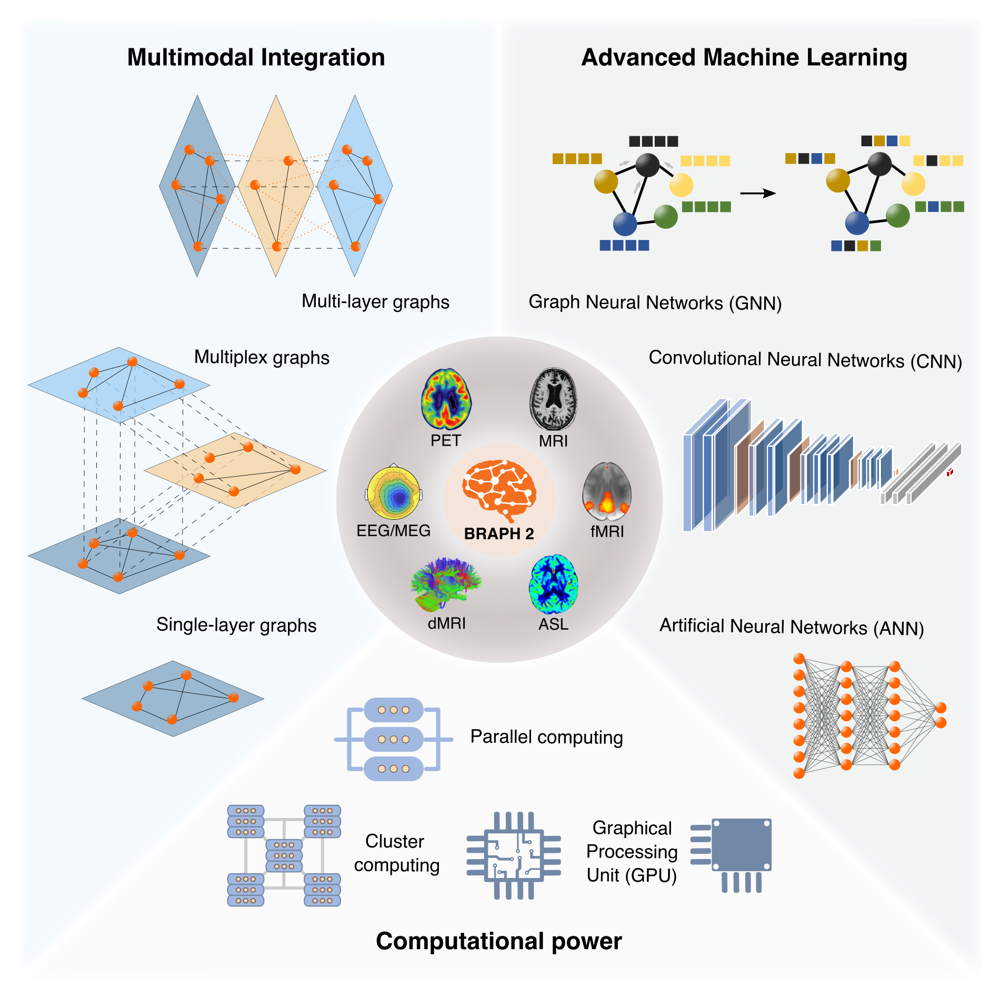

# BRAPH 2 — **F**lexible, **O**pen-source, **R**eproducible, **C**ommunity-Oriented, **E**asy-to-use Framework for Network Analysis in Neurosciences

[](https://braph2software.bsky.social)
[](https://doi.org/10.1101/2025.04.11.648455)
[](https://github.com/braph-software/BRAPH-2/releases)
[](https://zenodo.org/account/settings/github/repository/braph-software/BRAPH-2)

<br />

BRAPH 2 is a MATLAB-based framework for network analysis in neurosciences. Its **standard distribution** offers advanced multilayer graph analysis, deep learning, and statistical tools.
The hallmark of BRAPH 2 is **Genesis**, a compiler that lets you create **tailored distributions** by integrating your own methods or specialized pipelines alongside these built-in capabilities. This flexible architecture fosters community-driven innovation, scalability, and reproducibility across diverse research fields.


> 
> **Genesis advantages to compile a new custom BRAPH 2 distribution** To create a custom BRAPH 2 distribution with new methods or specialized analysis pipelines, users prepare a configuration file (genesis_config.txt) along with custom elements, pipeline scripts, and optional tutorial files. The Genesis module then integrates these with BRAPH 2’s core components through a structured compilation process, including directory setup, file integration, element compilation, GUI layout generation, and unit test creation. The final output is a customized, no-code GUI distribution, offering a flexible, open-source, reproducible, community-driven, and user-friendly framework for network analysis in neuroscience. A practical example can be found in the [BRAPH 2 Genesis Tutorials](tutorials/developers/dev_distribution) for creating a BRAPH 2 Hello, World! Distribution.

## Standard BRAPH 2 Distribution

BRAPH 2 ships with the **standard distribution**—provided in this very repository—which offers advanced tools for multilayer brain connectivity analysis and deep learning across various neuroimaging modalities. With its user-friendly interface and extensive analysis pipelines, researchers can explore the complex organization of the human brain using multimodal neuroimaging data, going beyond the limitations of traditional approaches. It provides an extensive set of analysis pipelines accessible through a graphical user interface (GUI) and through sample scripts, allowing users to perform ready-to-use analyses or develop customized pipelines for their specific needs. Detailed installation steps and tutorials follow below.


> 
> **Advances in brain connectivity analysis.** Brain connectivity analysis is rapidly evolving thanks to the widespread availability of increasing computational power and large-scale, high-resolution, multimodal neuroimaging datasets. The Standard BRAPH 2 Distribution provides a complete set of tools to analyze these data with conventional graph theory (single-layer graphs), multiplex and multilayer graphs, and deep learning (from dense neural networks to graph convolutional neural networks), as well as a flexible, easily expandable software architecture. BRAPH 2 uses parallel computing to allow users to run scripts on servers or clusters with both central processing units (CPUs) and graphical processing units (GPUs).

### Use Cases & Analysis Pipelines

The **Standard BRAPH 2 Distribution** provides a wide range of analysis pipelines that can be used for various use cases in brain connectivity analysis. For detailed information about these analysis pipelines, including their functionalities and step-by-step instructions, refer to the [BRAPH 2 Pipeline Tutorials](tutorials/pipelines). Here are some possible use cases in the **standard distribution**:

1. **Conventional Single-Layer Analyses**: The Standard BRAPH 2 Distribution offers pipelines to analyze single-layer graphs derived from different kinds of neuroimaging data. These pipelines involve loading the brain atlas, loading the subject data, constructing the graph, calculating graph measures of interest, and comparing groups. Single-layer analyses can be performed on connectivity data, functional data, and structural data.

3. **Multilayer Analyses**: The Standard BRAPH 2 Distribution supports the analysis of multilayer graphs, which capture the connectivity patterns across multiple layers or modalities. The multilayer analysis pipelines involve similar steps as single-layer analyses but operate on multilayer graphs. This allows researchers to explore the relationships between different layers or modalities of brain connectivity.

4. **Deep Learning Analyses**: The Standard BRAPH 2 Distribution enables the analysis of brain connectivity data using deep learning techniques. The deep learning pipelines involve loading the brain atlas, loading the subject data, constructing the input for deep learning models, splitting the dataset, training the models, and evaluating the model performance. Deep learning analyses can be applied to connectivity data, functional data, and structural data and graphs.


### Installation

To install the **Standard BRAPH 2 Distribution**, follow these steps:

1. Ensure that you have **MATLAB R2022a or a later version** installed on your system. BRAPH 2 is compatible with the versions of MATLAB for Microsoft Windows, MacOS, and Linux operating systems.

2. Make sure you have the following toolboxes installed in MATLAB:
    * **Statistics and Machine Learning Toolbox** (required for most pipelines)
    * **Parallel Computing Toolbox** (optional)
    * **Deep Learning Toolbox** (optional, for deep learning analysis)

3. Download the latest stable version of BRAPH 2 from [BRAPH 2 Releases](../../releases).

4. Unzip the downloaded file into the desired directory on your system.

5. Launch MATLAB.
   
7. Navigate to the `braph2` folder located in the directory where you unzipped BRAPH 2. 

9. Run the script `braph2`. This will launch the graphical user interface (GUI) from which you can choose an analysis pipeline.

10. Explore the [BRAPH 2 Tutorials](tutorials).

## Compatibility with MatLab Releases and Operative Systems
A &check; indicates that we have unit-tested the current release BRAPH 2 on the indicated Matlab release and operative system.

| Matlab Version        | Mac     | Win    | Linux   |
| :-------------------: | :-----: | :-----:| :-----: |
| R2022a                | [&check;](https://github.com/braph-software/BRAPH-2/issues/1753#issuecomment-2525332540)       | [&check;](https://github.com/braph-software/BRAPH-2/issues/1753#issuecomment-2524660497)      | [&check;](https://github.com/braph-software/BRAPH-2/issues/1753#issuecomment-2538931865)       |
| R2022b                | [&check;](https://github.com/braph-software/BRAPH-2/issues/1753#issuecomment-2543458907)       | [&check;](https://github.com/braph-software/BRAPH-2/issues/1753#issuecomment-2506774757)      | [&check;](https://github.com/braph-software/BRAPH-2/issues/1753#issuecomment-2538938388)      |
| R2023a                | [&check;](https://github.com/braph-software/BRAPH-2/issues/1753#issuecomment-2543318514)       | [&check;](https://github.com/braph-software/BRAPH-2/issues/1753#issuecomment-2500148139)      | [&check;](https://github.com/braph-software/BRAPH-2/issues/1753#issuecomment-2546621770)       |
| R2023b                | [&check;](https://github.com/braph-software/BRAPH-2/issues/1753#issuecomment-2520052354)       | [&check;](https://github.com/braph-software/BRAPH-2/issues/1753#issuecomment-2507237095)      | [&check;](https://github.com/braph-software/BRAPH-2/issues/1753#issuecomment-2547830566)       |
| R2024a                | [&check;](https://github.com/braph-software/BRAPH-2/issues/1753#issuecomment-2538706423)       | [&check;](https://github.com/braph-software/BRAPH-2/issues/1753#issuecomment-2521610430)      | [&check;](https://github.com/braph-software/BRAPH-2/issues/1753#issuecomment-2513852545)       |
| R2024b                | [&check;](https://github.com/braph-software/BRAPH-2/issues/1753#issuecomment-2523698722)       | [&check;](https://github.com/braph-software/BRAPH-2/issues/1753#issuecomment-2516894348)      | [&check;](https://github.com/braph-software/BRAPH-2/issues/1753#issuecomment-2523698722)       |

## For Developers

BRAPH 2 is designed to be an open community-driven project, and the code is freely available on this GitHub repository at BRAPH 2 Releases. Developers can contribute to BRAPH 2 at various levels of complexity, ranging from editing existing pipelines and adapting example scripts to implementing entirely new features. For the details on how to do this, refer to the [BRAPH 2 Developer Tutorials](tutorials/developers).

## Contribute to BRAPH 2

BRAPH 2 is an open-source project, and contributions from the community are highly encouraged. Whether you want to report a bug, suggest a new feature, create your tailored distribution, or contribute code improvements, your involvement is valuable and will help make BRAPH 2 even better.

### Bug Reports and Feature Requests

If you encounter any issues or have ideas for new features, please submit detailed information for bug reports using the [Bug Report](../../issues/new?template=bug_report.md) template and clear descriptions for feature requests using the [Feature Request](../../issues/new?template=feature_request.md) template.

### Create Your Tailored Distribution
Leverage BRAPH 2’s **Genesis** system to build custom distributions tailored to your specific research needs by selecting only the built-in elements you require—omitting anything unnecessary—and incorporating your own new elements into a self-contained package. For detailed instructions, refer to the [BRAPH 2 Genesis Tutorials](tutorials/developers/dev_distribution).

Existing tailored BRAPH 2 distributions:

- **[Hello, World!](https://github.com/c-yuwei/HelloWorld)**: A minimal BRAPH 2 distribution demonstrating the capabilities of Genesis in generating standalone, unit-tested, and GUI-ready BRAPH 2 distributions.
- **[Memory Capacity](https://github.com/braph-software/MemoryCapacity)**: A BRAPH 2 distribution applying the reservoir computing approach to compute global and nodal memory capacity. It has been used to produce results in the manuscript _“Computational Memory Capacity Predicts Aging and Cognitive Decline”_ by Mijalkov et al. (2025).

### Code Contributions

If you're interested in contributing with code, follow these steps:

1. Fork the BRAPH 2 repository on GitHub.

2. Create a new branch for your changes.

3. Make your modifications and commit them.

4. Push your branch to your forked repository.

5. Open a pull request against the `develop` branch of the main repository.

The core team of BRAPH 2 developers will then revise this proposal and possibly merge it or come back to you with questions and comments.

### Documentation Contributions

Improvements to the documentation are welcome. Submit a pull request as indicated above with your proposed changes for errors, outdated information, or suggestions for improvement.

### Community Support

Join discussions on the [BRAPH 2 Discussion Forum](https://github.com/braph-software/BRAPH-2/discussions) to provide support, answer questions, and share your expertise.

## Cite BRAPH 2

If you use BRAPH 2 in your research work, please cite the following publication:

https://www.biorxiv.org/content/10.1101/2025.04.11.648455v1

```
"BRAPH 2: a flexible, open-source, reproducible, community-oriented, easy-to-use framework for network analyses in neurosciences"
Yu-Wei Chang, Blanca Zufiria-Gerbolés, Emiliano Gómez-Ruiz, Anna Canal-Garcia, Hang Zhao, Mite Mijalkov, Joana B. Pereira, Giovanni Volpe.
bioRxiv (2025).
```
