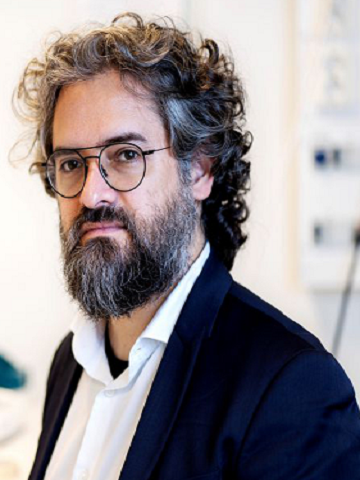
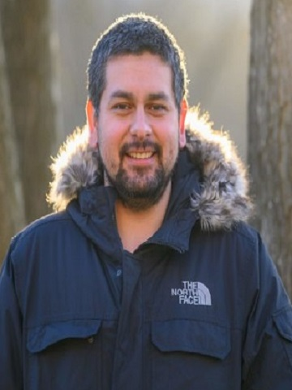
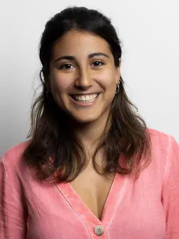
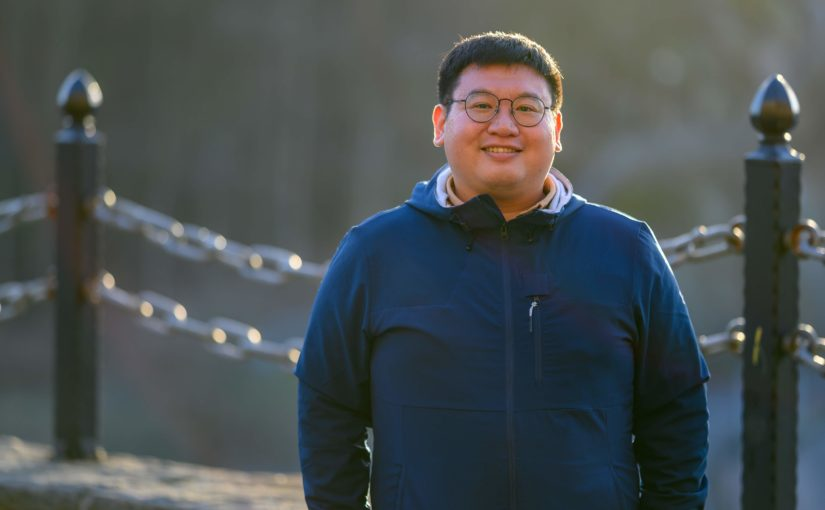
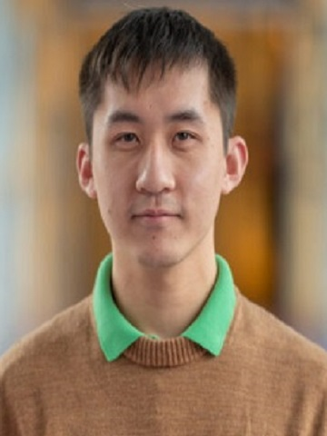
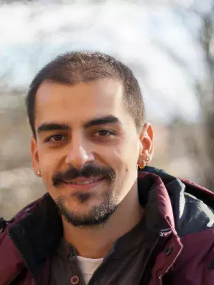

# BRAPH 2.0 — Contributors

---

## Prof. Giovanni Volpe
<table>
<tr>
<td>

**Department of Physics**, University of Gothenburg, Gothenburg, Sweden  
Email: [giovanni.volpe@physics.gu.se](mailto:giovanni.volpe@physics.gu.se)

</td>
<td>

</td>
</tr>
</table>

---

## Dr. Joanna B. Pereira
<table>
<tr>
<td>

**Department of Clinical Neuroscience**, Karolinska Institutet, Stockholm, Sweden  
Email: [joana.pereira@ki.se](mailto:joana.pereira@ki.se)

</td>
<td>

</td>
</tr>
</table>

---

## Emiliano Gomez Ruiz
<table>
<tr>
<td>

**Department of Physics**, University of Gothenburg, Gothenburg, Sweden  
Email: [emiliano.gomez@physics.gu.se](mailto:emiliano.gomez@physics.gu.se)

</td>
<td>

</td>
</tr>
</table>

---

## Anna Canal García
<table>
<tr>
<td>

**Department of Clinical Neuroscience**, Karolinska Institutet, Stockholm, Sweden  
Email: [anna.canal.garcia@ki.se](mailto:anna.canal.garcia@ki.se)

</td>
<td>

</td>
</tr>
</table>

---

## Yu-Wei Chang
<table>
<tr>
<td>

**Department of Physics**, University of Gothenburg, Gothenburg, Sweden  
Email: [yuwei.chang@physics.gu.se](mailto:yuwei.chang@physics.gu.se)

</td>
<td>

</td>
</tr>
</table>

---

## Hang Zhao
<table>
<tr>
<td>

**Department of Physics**, University of Gothenburg, Gothenburg, Sweden  
Email: [hang.zhao@physics.gu.se](mailto:hang.zhao@physics.gu.se)

</td>
<td>

</td>
</tr>
</table>

---

## Blanca Zufiria
<table>
<tr>
<td>

**Department of Clinical Neuroscience**, Karolinska Institutet, Stockholm, Sweden  
Email: [blanca.zufiria.gerboles@ki.se](mailto:blanca.zufiria.gerboles@ki.se)

</td>
<td>

</td>
</tr>
</table>

---

## Jiawei Sun
<table>
<tr>
<td>

**Department of Clinical Neuroscience**, Karolinska Institutet, Stockholm, Sweden  
Email: [jiawei.sun@ki.se](mailto:jiawei.sun@ki.se)

</td>
<td>

</td>
</tr>
</table>

---

## Prof. Eric Westman
<table>
<tr>
<td>

**Department of Clinical Neuroscience**, Karolinska Institutet, Stockholm, Sweden  
Email: [eric.westman@ki.se](mailto:eric.westman@ki.se)

</td>
<td>

</td>
</tr>
</table>

---

## Dr. Mite Mijalkov
<table>
<tr>
<td>

**Department of Clinical Neuroscience**, Karolinska Institutet, Stockholm, Sweden  
Email: [mite.mijalkov@ki.se](mailto:mite.mijalkov@ki.se)

</td>
<td>

</td>
</tr>
</table>

---

## Dr. Daniel Vereb
<table>
<tr>
<td>

**Department of Clinical Neuroscience**, Karolinska Institutet, Stockholm, Sweden  
Email: [daniel.vereb@ki.se](mailto:daniel.vereb@ki.se)

</td>
<td>

</td>
</tr>
</table>
