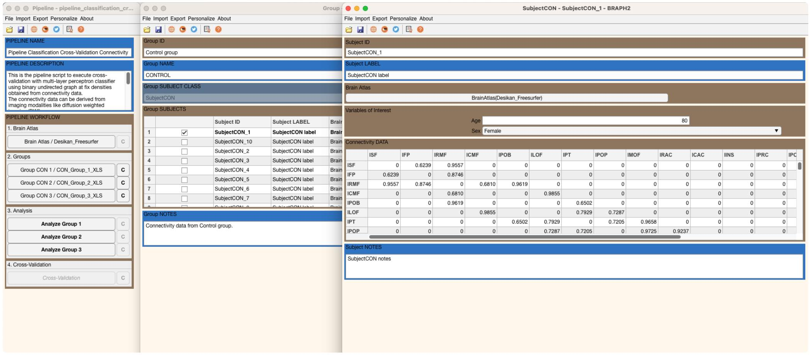
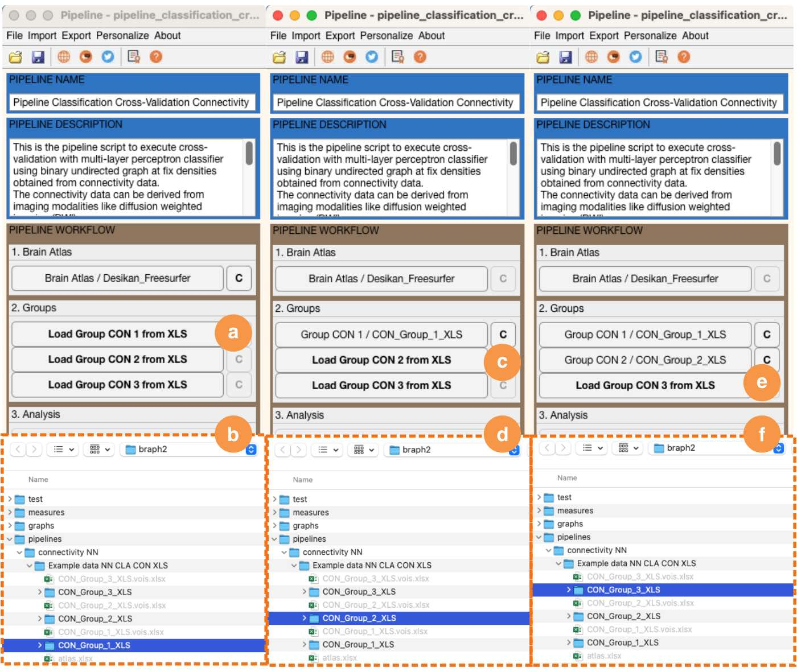
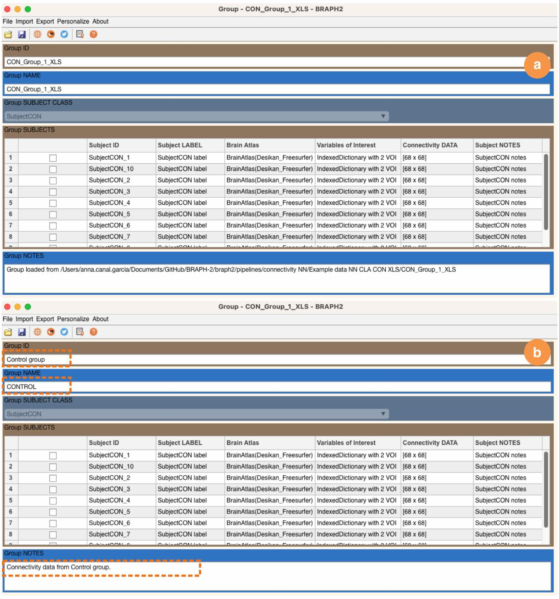
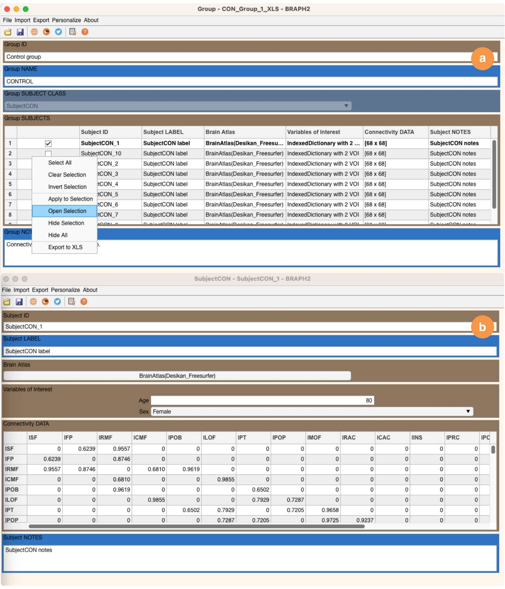
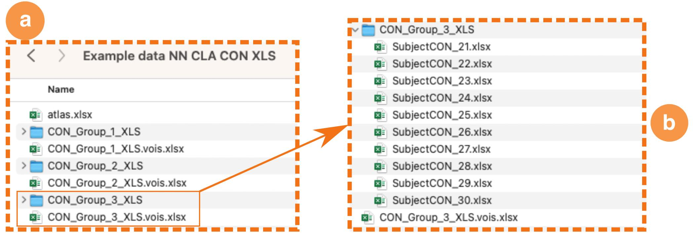

# Group of Subjects with Connectivity Data for NN Classification

[](tut_gr_con_nn.pdf)

For *connectivity NN data*, a connectivity matrix per subject is already available and can be directly imported into the relative analysis pipeline. For example, the connectivity matrix could correspond to white matter tracts obtained from dMRI or pre-calculated coactivations maps obtained from fMRI data.
This tutorial explains how to prepare and work with this kind of data.




> **Figure 1. GUI for a group of subjects with connectivity NN data**
> Full graphical user interface to upload a group of subjects with connectivity NN data in BRAPH 2.

## Table of Contents
> [Generation of Example Data](#Generation-of-Example-Data)
>
> [Open the GUI](#Open-the-GUI)
>
> [Visualize the Group Data](#Visualize-the-Group-Data)
>
> [Visualize Each Subject's Data](#Visualize-Each-Subjects-Data)
>
> [Preparation of the Data to Be Imported](#Preparation-of-the-Data-to-Be-Imported)
>
> [Adding Covariates](#Adding-Covariates)
>


<a id="Generation-of-Example-Data"></a>
## Generation of Example Data  [⬆](#Table-of-Contents)

If you do not have the "Example data NN CLA CON XLS" folder inside "connectivity NN", then you can generate it by running the commands in Code 1.


> **Code 1.** **Code to generate the example data folder.**
> 		This code can be used in the MatLab command line to generate the "Example data NN CLA CON XLS" folder to the "connectivity NN" pipeline folder.
> ````matlab
> create_data_NN_CLA_CON_XLS  ①
> ````
> 
> ① generates the example connectivity NN XLS data folder for classification.
> 

<a id="Open-the-GUI"></a>
## Open the GUI  [⬆](#Table-of-Contents)

In most analyses, the group GUI is the second step after you have selected a brain atlas. You can open it by typing `braph2` in the MatLab's terminal, which allows you to select a pipeline containing the steps required to perform your analysis and upload a brain atlas. After these steps have been completed you can upload your group's data directly, in this example, we will upload 3 groups for the connectivity NN classification (Figure 2). 




> **Figure 2. Upload the data of a group of subjects**
> Steps to upload a group of subjects with connectivity data using the GUI and an example dataset: 
> 	**a** Click on "Load Group CON 1 from XLS".
> 	**b** Navigate to the BRAPH 2 folder "pipelines", "connectivity NN", "Example data NN CLA CON XLS", and select the folder containing the connectivity matrices of group one "CON_Group_1_XLS".
>         **c** Click on "Load Group CON 2 from XLS".
> 	**d** Navigate to the BRAPH 2 folder "pipelines", "connectivity NN", "Example data NN CLA CON XLS", and select the folder containing the connectivity matrices of group two "CON_Group_2_XLS".
>         **e** Click on "Load Group CON 3 from XLS".
>         **f** Navigate to the BRAPH 2 folder "pipelines", "connectivity NN", "Example data NN CLA CON XLS", and select the folder containing the connectivity matrices of group three "CON_Group_3_XLS".


> **GUI launch from command line**
> You can also open the GUI and upload the brain connectivity data using the command line (i.e., without opening an analysis pipeline) by typing the commands in Code 2. In this case, you can upload the data as shown in Figure 2a-f.
> 
> 
> > **Code 2.** **Code to launch the GUI to upload a group of subjects with connectivity data.**
> > 		This code can be used in the MatLab command line to launch the GUI to upload a group of subjects with connectivity data without having to open a pipeline.
> > ````matlab
> > gr = Group('SUB_CLASS', 'SubjectCON');
> > 
> > gui = GUIElement('PE', gr);
> > gui.get('DRAW')
> > gui.get('SHOW')
> > ````
> >

<a id="Visualize-the-Group-Data"></a>
## Visualize the Group Data  [⬆](#Table-of-Contents)

After completing the steps described in Figure 2, you can see the data (Figure 3a), and change the Group ID, name, and notes (Figure 3b). 




> **Figure 3. Edit the group metadata**
> **a** The GUI of the group's connectivity data. 
> 	**b** The information you see on this GUI that can be changed. In this example, we have edited the ID, name, and notes of the group but can also change the subject's specific information.

<a id="Visualize-Each-Subjects-Data"></a>
## Visualize Each Subject's Data  [⬆](#Table-of-Contents)

Finally, you can open each subject's connectivity matrix by selecting the subject, right click, and select "Open selection" (Figure 4a), which shows the matrix values (Figure 4b). Here, you can also change the subject's metadata (ID, label, notes), its variables of interest, and the values of its connectivity matrix.




> **Figure 4. Edit the individual subject data**
> **a**  Each subject's connectivity matrix can be opened by selecting the subject, right click, and select "Open selection"
> 	**b** In this subject GUI, it is possible to view and edit the metadata of the subject (ID, label, notes), its variables of interest (in this case, age and sex), and the values of the connectivity matrix.


<a id="Preparation-of-the-Data-to-Be-Imported"></a>
## Preparation of the Data to Be Imported  [⬆](#Table-of-Contents)

To be able to import connectivity NN data into BRAPH 2, you need to include the connectivity matrices for each subject in excel or text format inside a folder with the name of the group. The structure of the connectivity matrices in XLS can be checked at the tutorial [Group of Subjects with Connectivity Data](https://github.com/braph-software/BRAPH-2/tree/develop/tutorials/data/tut_gr_con). Below in Figure 5 you can see the directory structure:

 



> **Figure 5. Data preparation**
> The data should be organised in the following format:
> 	**a** You should include more than one group to perfom a classification. The directory follows the same structure as the connectivity data ([Group of Subjects with Connectivity Data](https://github.com/braph-software/BRAPH-2/tree/develop/tutorials/data/tut_gr_con)). 
> 	**b** The connectivity matrices from each subject should be included in one folder (for example, "CON_group_3_XLS").

<a id="Adding-Covariates"></a>
## Adding Covariates  [⬆](#Table-of-Contents)

It is very common to have *variables of interest* (i.e., *covariates* and *correlates*) in an analysis. In BRAPH 2, these variables of interest should be included in a separate excel file placed just outside the group's folder and with the same name as the folder followed by ".vois" ([Group of Subjects with Connectivity Data](https://github.com/braph-software/BRAPH-2/tree/develop/tutorials/general/tut_gr_con)).
This file should have a specific format:


- **Subject IDs (column A).**
Column A should contain the subject IDs starting from row 3.

- **Variables of interest (column B and subsequent columns).**
Column B (and subsequent columns) should contain the variables of interest (one per column). 
In this example we have "Age" and "Sex", as in the example file, as well as the additional "Education".
In each column, row 1 should contain the name of the variable of interest, row 2 should contain the categories separated by a return (only for categorical variables of interest, like "Sex" and "Education"), and the subsequent rows the values of the variable of interest for each subject.
