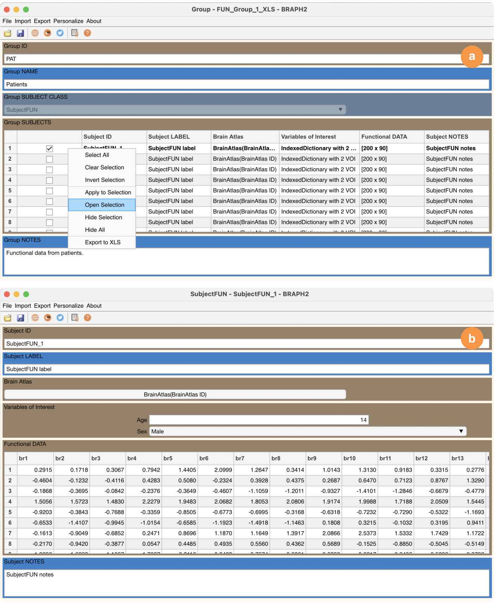

# Group of Subjects with Functional Data

[](tut_gr_fun.pdf)

For *functional data*, you will upload a folder containing the functional files for different subjects that belong to the same group. For example, the functional values could correspond to brain activation signals derived from functional MRI data, from which a connectivity matrix is later computed using correlations in functional values between each pair of brain regions. This tutorial explains how to prepare and work with this kind of data.


> **Figure 1. GUI for a group of subjects with functional files**
> Full graphical user interface to upload a group with functional data in BRAPH 2.

## Table of Contents
> [Generation of Example Data](#Generation-of-Example-Data)
>
> [Open the GUI](#Open-the-GUI)
>
> [Visualize the Group Data](#Visualize-the-Group-Data)
>
> [Visualize Each Subject's Data](#Visualize-Each-Subjects-Data)
>
> [Preparation of the Data to Be Imported](#Preparation-of-the-Data-to-Be-Imported)
>
> [Adding Covariates](#Adding-Covariates)
>


<a id="Generation-of-Example-Data"></a>
## Generation of Example Data  [⬆](#Table-of-Contents)

If you do not have the "Example data FUN XLS" folder inside "functional", then you can generate it by running the commands in Code 1.


> **Code 1.** **Code to generate the example data folder.**
> 		This code can be used in the MatLab command line to generate the "Example data FUN XLS" folder to the "functional" pipeline folder.
> ````matlab
> create_data_FUN_XLS()  ①
> create_data_FUN_TXT()  ②
> ````
> 
> ① generates the example functional XLS data folder.
> 
> ② generates the example functional TXT data folder.
> 

<a id="Open-the-GUI"></a>
## Open the GUI  [⬆](#Table-of-Contents)

In most analysis pipelines, the group GUI is the second step after you have selected a brain atlas. You can open it by typing `braph2` in MatLab's terminal, which allows you to select a pipeline containing the steps required to perform your analysis and upload a brain atlas. After these steps have been completed you can upload your group's data directly (Figure 2c-f) after clicking "Load Group". 


	


> **Figure 2. Upload the data of a group of subjects**
> Steps to upload a group of subjects with functional data using the GUI and an example dataset: 
> 	**a** Open the group GUI.
> 	**b** Import the folder with the functional files in XLS or TXT format (see below for details on their format).
> 	To upload the test functional data:
> 	**c**-**f** navigate to the BRAPH 2 folder "pipelines", **d** "functional",  **e** "Example data FUN XLS", and **f** select the folder with functional values of one group "FUN_Group_1_XLSX".
	

> **GUI launch from command line**
> You can also open the GUI and upload the brain functional data using the command line (i.e., without opening an analysis pipeline) by typing the commands in Code 2. In this case, you can upload the data as shown in Figure 2a-f.
> 
> 
> > **Code 2.** **Code to launch the GUI to upload a group of subjects with functional data.**
> > 		This code can be used in the MatLab command line to launch the GUI to upload a group of subjects with functional data without having to open a pipeline.
> > ````matlab
> > gr = Group('SUB_CLASS', 'SubjectFUN');
> > 
> > gui = GUIElement('PE', gr);
> > gui.get('DRAW')
> > gui.get('SHOW')
> > ````
> >

<a id="Visualize-the-Group-Data"></a>
## Visualize the Group Data  [⬆](#Table-of-Contents)

After completing the steps described in Figure 2, you can see the data (Figure 3a), and change the Group ID, name, and notes (Figure 3b). 


> **Figure 3. Edit the group metadata**
> **a** The GUI of the group's functional data. 
> 	**b** The information you see on this GUI that can be changed. In this example, we have edited the ID, name, and notes of the group but can also change the subject's specific information.

<a id="Visualize-Each-Subjects-Data"></a>
## Visualize Each Subject's Data  [⬆](#Table-of-Contents)

Finally, you can open each subject's functional values by selecting the subject, right click, and select "Open selection" (Figure 4a), which shows the functional values (Figure 4b). Here, you can also change the subject's metadata (ID, label, notes), its variables of interest, and the functional values.




> **Figure 4. Edit the individual subject data**
> **a** Each subject's functional values can be opened by selecting the subject, right click, and select "Open selection"
> 	**b** In this subject GUI, it is possible to view and edit the metadata of the subject (ID, label, notes), its variables of interest (in this case, age and sex), and the functional values.


<a id="Preparation-of-the-Data-to-Be-Imported"></a>
## Preparation of the Data to Be Imported  [⬆](#Table-of-Contents)

To be able to import functional data into BRAPH 2, you need to include the functional values in a separate file for each subject in excel or text format. Below you can see how this file should look like.


> **Figure 5. Data preparation**
> The data should be organised in the following format:
> 	**a** The functional values from each subject should be included in a separate file (for example, "FUN_Group_1_xlsx"). 
> 	**b** This file should contain the functional values for each brain region belonging to a brain atlas. In this example, the (simulated) values correspond to brain activation signals of 90 brain regions derived from functional MRI.

<a id="Adding-Covariates"></a>
## Adding Covariates  [⬆](#Table-of-Contents)


	
It is very common to have *variables of interest* (i.e., *covariates* and *correlates*) in an analysis. In BRAPH 2, these variables of interest should be included in a separate excel file placed just outside the group's folder and with the same name as the folder followed by ".vois" (Figure 6a). This file should have a specific format (Figure 6b):


- **Subject IDs (column A).**
Column A should contain the subject IDs starting from row 3.

- **Variables of interest (column B and subsequent columns).**
Column B (and subsequent columns) should contain the variables of interest (one per column). 
In this example we have "Age" and "Sex", as in the example file, as well as the additional "Education".
In each column, row 1 should contain the name of the variable of interest, row 2 should contain the categories separated by a return (only for categorical variables of interest, like "Sex" and "Education"), and the subsequent rows the values of the variable of interest for each subject.


> **Figure 6. Edit the Covariates**
> Information that can be changed in the Covariates file: 
> 	**a** The values of the variables of interest (vois).
> 	**b** In case the vois are categorical, you can state which categories they have.
