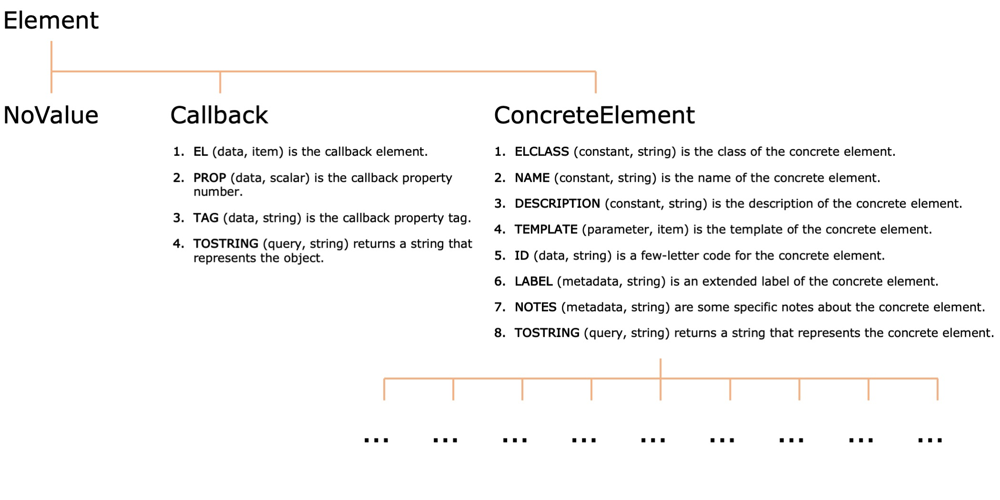
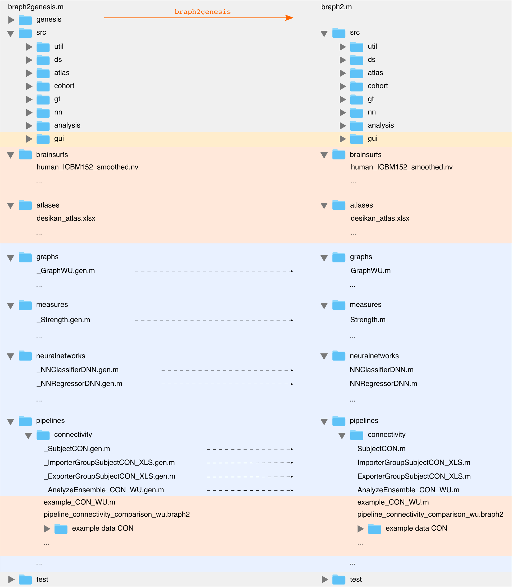

# General Developer Tutorial for BRAPH 2.0

[](dev_intro.pdf)

The software architecture of BRAPH 2.0 provides a clear structure for developers to understand and extend its functionalities. All objects (_elements_) in BRAPH 2.0 are derived from the base object `Element`. Developers can easily add new elements by writing the new elements in the simplified BRAPH 2.0 pseudocode. 
By recompiling BRAPH 2.0, the new elements and their functionalities are immediately integrated, also into the graphical user interface.
In this Developer Tutorial, we will explain how BRAPH 2.0 is compiled, how the elements are strcutured, and how new elements can be implemented.


## Table of contents
>
> [Compilation and Element (Re)Generation](#Compilation-and-Element-(Re)Generation)
>
> [Elements](#Elements)
>
>> [Setting Props](#Setting-Props)
>
>> [Getting Props](#Getting-Props)
>
>> [Memorizing Props](#Memorizing-Props)
>
> [Element tokens](#Element-tokens)
>
> [Overview of Elements](#Overview-of-Elements)
>
> [Implementation of an Element](#Implementation-of-an-Element)
>
>> [A Simple Calculator](#A-Simple-Calculator)
>
>> [Calculator with Seeded Randomness](#Calculator-with-Seeded-Randomness)
>
>> [Query](#Query)
>
>> [Evanescent, Gui, Figure](#Evanescent,-Gui,-Figure)


## Compilation and Element (Re)Generation  [⬆](#table-of-contents)

BRAPH 2.0 is a compiled object-oriented programming software.
Its objects are _elements_, which contain a set of _props_ of various _categories_ and _formats_, as described in detail in the following sections. 
These elements are written in the BRAPH 2.0 pseudocode, which simplifies and streamlines the coding process.
To convert them into usable matlab objects, BRAPH 2.0 needs to be compiled, which is done by calling the script `braph2genesis`, which will compile the whole code, as shown in Compilation of BRAPH 2.0.

**Compilation of BRAPH 2.0.**
		Executing the script `braph2genesis` compiles BRAPH 2.0 and , subsequently, unit tests it.
		Importantly, this function might take several hours to run (plus several more hours to unit test the compiled code).
> ```matlab
> 
> >> braph2genesis
> 


During the compilation, there are several phases to improve the computational efficiency of the executable code:
1. **First compilation**, where the elements are created.
2. **Second compilation**, where the elements are computationally optimized.
3. **Constant hard-coding**, where several contants are hard-coded in the executable code to further optimize the run time


Because this multi-stage compilation, it is not always possible to regenerate a single element without regenerating the whole BRAPH 2.0. 
Nevertheless, it is usually possible to regenerate a single element as long as the element already exists and its props have not been changed.
This can be done with the function `regenerate()`, as shown in Regeneration of elements.

**Regeneration of elements.**
		The function `regenerate()` can be used to regenerate some elements, as long as they already exist in the current BRAPH 2.0 compilation and their list of props has not been altered (e.g., renamed, moved, added). In this case, it is necessary to recompile BRAPH 2.0 with `braph2genesis`.
> ```matlab
> 
> >> close all; delete(findall(0, 'type', 'figure')); clear all ①
> 
> >> regenerate(regenerate('/src/gui', {'Pipeline'}) ②
> 
> >> regenerate(regenerate('/src/gui', {'Pipeline'}, 'DoubleCompilation', false) ③
> 
> >> regenerate(regenerate('/src/gui', {'Pipeline'}, 'CreateElement', false) ④
> 
> >> regenerate(regenerate('/src/gui', {'Pipeline'}, 'CreateLayout', false) ⑤
> 
> >> regenerate(regenerate('/src/gui', {'Pipeline'}, 'CreateTest', false) ⑥
> 
> >> regenerate(regenerate('/src/gui', {'Pipeline'}, 'UnitTest', false) ⑦
> 
> >> regenerate(regenerate('/src/gui', {'Pipeline'}, 'CreateLayout', false, 'UnitTest', false) ⑧
> 
> >> regenerate(regenerate('/src/gui', {'Pipeline', 'GUI'}) ⑨
> 

> ① clears the workspace (not always necessary, but needed is some element instances are still in the workspace).
>
> ② regenerates `Pipeline`.
>
> ③ performs only one compilation.
>
> ④ does not regenerate the element, but only the layout and the unit test.
>
> ⑤ does not regenerate the layout.
>
> ⑥ does not regenerate the unit test.
>
> ⑦ does not perform the unit test.
>
> ⑧ Multiple options can be selected at once. In this ces, it does not regenerate the layout and it does not perform the unit test.
>
> ⑨ Multiple elements can be regenerated at once. This can throw an error, typically because an instance of the element to be regenerated remains in the workspace. In this case, regenerate the elements one by one.
>


## Elements  [⬆](#table-of-contents)

The base class for all elements is `Element`. 
Each element is essentially a container for a series of _props_ (properties). Each prop is characterized by the following static features (i.e., equal for all instances of the prop):
- A _sequential number_ (integer starting from 1).
- A _tag_ (a string).
- A _category_, which determines for how a prop is used. The possible categories and formats are shown in the boxes below.
- A _format_, which determines what a prop can contain.

The functions to inspect these features can be found by using the command `help Element` in the MatLab command line.

Furthermore, each instance of a prop has the following features:
- A _value_. The value is by defalut a `NoValue`. For `PARAMETER`, `DATA`, `FIGURE`, and `GUI` props, it can also be a callback. For `CONSTANT` props, it is usually a concrete value.
	The functions to set, get, and memorize a value will be discussed in the following sections.
- A _seed_ for the random number generator to ensure the reproducibility of the results. 
	The seed of each property is a 32-bit unsigned integer and is initialized when an element is constructed by calling `randi(intmax('uint32'))`.
	
	The seed can be obtained using:
- A _checked_ status, which is true by default.
	Checked props are checked for format when they are set and for value when they are set/calculated. When `BRAPH2.CHECKED = false`, no checks are performed. This needs to be changes in the file "BRAPH2.m".
	
	The checked status of a prop can be altered with the functions:
- A _locked_ status, which is false by default. The `PARAMETER` and `DATA` props get locked the first time a `RESULT` property is successfully calculated. The locked status is not used for `CONSTANT` props.
	
	A prop can be locked with the function:
- A _callback_ instance. Callbacks are not used with `METADATA` props.
	
	The callback to a prop can be obtained using the function:

Additional functions to operate with these features can be found by using the command `help Element` in the MatLab command line.


> **Property Categories**
 > `CONSTANT` Static constant equal for all instances of the element. It allows incoming callbacks.
>
> `METADATA` Metadata NOT used in the calculation of the results. It does not allow callbacks. It is not locked when a result is calculated.
>
> `PARAMETER` Parameter used to calculate the results of the element. It allows incoming and outgoing callbacks. It is connected with a callback when using a template. It is locked when a result is calculated.
>
> `DATA` Data used to calculate the results of the element. It is `NoValue` when not set. It allows incoming and outgoing callbacks. It is locked when a result is calculated.
>
> `RESULT` Result calculated by the element using parameters and data. The calculation of a result locks the element. It is `NoValue` when not calculated. It allows incoming callbacks.
>
> `QUERY` Query result calculated by the element. The calculation of a query does NOT lock the element. It is `NoValue` when not calculated. Typically, it should not be memorized.
It does not allow callbacks.
>
> `EVANESCENT` Evanescent variable calculated at runtime (typically employed for handles of GUI components). It is `NoValue` when not calculated. Typically, it should be memorized at first use.
It does not allow callbacks.
>
> `FIGURE` Parameter used to plot the results in a figure. It allows incoming and outgoing callbacks. It is not locked when a result is calculated.
>
> `GUI` Parameter used by the graphical user interface (GUI). It allows incoming and outgoing callbacks. It is not locked when a result is calculated. 



> **Property Formats**
 > - `EMPTY` Empty has an empty value and is typically used as a result or query to execute some code.
> - `STRING` String is a char array.
> - `STRINGLIST` StringList is a cell array with char arrays.
> - `LOGICAL` Logical is a boolean value.
> - `OPTION` Option is a char array representing an option within a set defined in the element (case sensitive). 
                Settings: cell array of chars representing the options, e.g., `{'plus', 'minus', 'zero'`}.
>
> - `CLASS` Class is a char array corresponding to an element class.
                Settings: class name of a subclass of Element (or Element itself).
>
> - `CLASSLIST` ClassList is a cell array with char arrays corresponding to element classes.
                Settings: class name of a subclass of Element (or Element itself), which represents the base element.
>
> - `ITEM` Item is a pointer to an element of a class defined in the element. 
                Settings: class name of a subclass of Element (or Element itself).
>
> - `ITEMLIST` ItemList is a cell array with pointers to elements of a class defined in the element.
                Settings: class name of a subclass of Element (or Element itself), which represents the base element.
>
> - `IDICT` Idict is an indexed dictionary of elements of a class defined in the element.
                Settings: class name of a subclass of Element (or Element itself), which represents the dictionary element.
>
> - `SCALAR` Scalar is a scalar numerical value.
> - `RVECTOR` RVector is a numerical row vector.
> - `CVECTOR` CVector is a numerical column vector.
> - `MATRIX` Matrix is a numerical matrix.
> - `SMATRIX` SMatrix is a numerical square matrix.
> - `CELL` Cell is a 2D cell array of numeric data, typically used for adjaciency matrices and measures.
> - `NET` Net is a MatLab neural network object (network, SeriesNetwork, DAGNetwork, dlnetwork).
> - `HANDLE` Handle is a handle for a graphical or listener component. It should only be used as an evanescent property.
> - `HANDLELIST` HandleList is a cell array with handles for graphical or listener components. It should only be used as an evanescent property.
> - `COLOR` Color is an RGB color, e.g., `'[1 0 0]'` for red.
> - `ALPHA` Alpha is a transparency level between 0 and 1.
> - `SIZE` Size represents the size of a graphical componet. It is a positive number (default = 1).
> - `MARKER` Marker represents the marker style.
                It can be `'o'`, `'+'`, `'*'`, `'.'`, 'x', `'_'`, `'|'`, `'s'`, `'d'`, `'^'`, `'v'`, `'>'`, `'<'`, `'p'`, `'h'`, `''` (no marker).
>
> - `LINE` Line represents the line style. It can be `'-'`, `':'`, `'-.'`, `'--'`, `''` (no line). 


Even though it is possible to create instances of `Element`, typically one uses its subclasses and does not have any props.
Its three direct subclasses are `NoValue`, `Callback`, and `ConcreteElement`, as shown in Figure NaN.




> **Figure 1. Element tree**
> All elements derive from the base class `Element`. 
	Its direct children are `NoValue`, `Callback`, and `ConcreteElement`, whose properties are also indicated.
	Concrete elements further derive directly or indirectly from `ConcreteElement`.
	


The element `NoValue` is used to represent a value that has not been set (for properties of categories `METADATA`, `PARAMETER`, `DATA`, `FIGURE` or `GUI`) or calculated (for properties of category `RESULT`, `QUERY`, `EVANESCENT`), while it should not be used for properties of category `CONSTANT`.
It should be instantiated using Instantiation of `NoValue`.

**Instantiation of `NoValue`.**
		For computational efficiency, it is best to use only one instance using this script, instead of creating new instances using the constructor `NoValue()`.
> ```matlab
> 
> Element.getNoValue()
> 


No element can be a subclass of NoValue.
  
A `Callback` refers to a prop of another element `el`, identified by prop number or tag.
It should be instantiated using Instantiation of a `Callback`.

**Instantiation of a `Callback`.**
		For computational efficiency, it is best to use only one instance of `Callback` for each prop of an instance of a concrete element `el` with the code shown below, instead of creating new callback instances using its constructor.
> ```matlab
> 
> el.getCallback('PROP', PROP_NUMBER)
> el.getCallback('TAG', PROP_TAG)
> 


No element can be a subclass of `Callback`.

A concrete element (`ConcreteElement`) provides the infrastructure necessary for all concrete elements. 
In particular, it has the constant props `ELCLASS` (string), `NAME` (string) and `DESCRIPTION` (string), the property `TEMPLATE` (item), the indexing properties `ID` (string), `LABEL` (string), and `NOTES` (string), and the query prop `TOSTRING` (string).
Even though it is possible to create instances of `ConcreteElement`, typically one uses its subclasses.

### Setting Props  [⬆](#table-of-contents)

The value of a prop can be set with Setting a prop.

**Setting a prop.**
		This script illustrates various ways in which props can be set.
> ```matlab
> 
> el.set('ID', 'new el id') ①
> el.set(5, 'new el id') ②
> 
> el.set( ... ③
> 	'ID', 'new el id', ...
> 	'LABEL', 'new el label', ...
> 	7, 'new el notes' ...
> 	) 
> 
> el = el.set('ID', 'new el id') ④
> 

> ① ② set the value of a prop with the prop tag or the prop number.
>
> ③ sets the values of multiple props at once. The pointers can be either property numbers or property tags.
>
> ④ returns the element.
>


When a prop is set to a certain value, the following operations are performed:
1. The value is **conditioned** before being set (by calling the protected _static_ function `conditioning()`, which can be defined in each subelement).

This can be set with the token `¡conditioning!`.

2. The value is **preset** before being set (by calling the protected function `preset()`, which can be defined in each subelement). Differently from the _static_ function `conditioning()`, the function `preset()` has access to the element instance.

This can be set with the token `¡preset!`.

3. If a property is checked, its **format is checked** before proceeding to its setting by calling `Format.checkFormat()`.
If the check fails, the property is not set and an error is thrown with error id
`BRAPH2:<Element Class>:WrongInput`.

This can be set with the token `¡checkProp!`.

4. The value is **set**.

If the property is of category `PARAMETER`, `DATA`, `FIGURE`, or `GUI`, the value is set only if the property is unlocked.
If an attempt is made to set a locked property, no setting occurs and a warning is thrown with warning id `BRAPH2:<Element Class>`.
If the value is a callback, a warning is thrown if the element, property number and/or settings of the callback do not coincide with those of the property with warning id
`BRAPH2:<Element Class>`.
 
If the property is of category RESULT, QUERY or EVANESCENT, the value can only be set to `Element.getNoValue()`.

5. The value is **postset** after being set (by calling the protected function `postset()`, which is defined in each subelement).

This can be set with the token `¡postset!`.

6. **All props** are **postprocessed** after being set (by calling the protected function `postprocessing()`, which is defined in each subelement).

This can be set with the token `¡postprocessing!`.

7. If ANY property is checked, the function `Element.check()` is called after all settings are made and the consistency of the values of **all pros** are **checked**.
If the check fails an error is thrown with error id
`BRAPH2:<Element Class>:WrongInput`.

8. When a prop is successfully set, an **event** `PropSet()` is **notified**
 

### Getting Props  [⬆](#table-of-contents)

The value of a prop can be retrieved with Getting a prop.

**Getting a prop.**
		This script illustrates various ways in which the value of a prop can be retrieved.
> ```matlab
> 
> value = el.get('ID'); ①
> 
> value = el.get(ConcreteElement.ID); ②
> 
> el.get('ID') ③
> el.get(ConcreteElement.ID) ④
> 
> value = el.get('QUERY', ARG1, ARG2, ... ); ⑤
> 

> ① gets the value of a prop using the prop tag.
>
> ② gets the value of a prop using the prop number.
>
> ③ ④ do not return any output value. This can be useful, e.g., when a code needs to be executed, e.g., by a `QUERY`.
>
> ⑤ can be used with a series of arguments for props of category `QUERY`. Any additional arguments are ignored for props of other categories.
>


If the raw value of the property is a `NoValue`, it proceed to return the default property value (for categories `METADATA`, `PARAMETER`, `DATA`, `FIGURE`, and `GUI`).
 
If the raw value of the property is a callback, it retrieves the value of the linked property (for categories `PARAMETER`, `DATA`, `FIGURE`, and `GUI`).
 
If a property of category `RESULT`, `QUERY`, or `EVANESCENT` is not calculated (i.e., its raw value is `NoValue`), it proceeds to calculate it (but not to memorize it, i.e., its raw value remains `NoValue`). After the calculation of a property of category `RESULT` all properties of categories `PARAMETER` and `DATA` are irreversibly locked.
If the property is checked, it proceeds to check all properties after the calculation calling the function `check()`. If the check fails, it resets the property to `NoValue` and returns `NoValue`, does not lock the property, and throws a warning with warning id `BRAPH2:<Element Class>`.

The raw value of a prop can be retrieved with Getting the raw value of a prop.

**Getting the raw value of a prop.**
		This script illustrates various ways in which the raw value of a prop can be retrieved.
> ```matlab
> 
> value = el.getr('ID');
> value = el.getr(ConcreteElement.ID);
> 


### Memorizing Props  [⬆](#table-of-contents)  

The value of a prop can be memorized using memorize.

**Getting a prop.**
		This script illustrates various ways in which the value of a prop can be retrieved.
> ```matlab
> 
> value = el.memorize('ID'); ①
> value = el.memorize(ConcreteElement.ID); ②
> 
> el.memorize('ID') ③
> el.memorize(ConcreteElement.ID) ④
> 

> ① ② memorize the value of a prop using the prop tag and the prop number.
>
> ③ ④ do not return any output value.
>


If the property is of category `RESULT`, `QUERY`, or `EVANESCENT`, it calls the function check, proceed to save the result, and notifies an **event PropMemorized**.

If the property is _not_ of category `RESULT`, `QUERY`, or `EVANESCENT` and has not been set yet, it sets it to its default value.
 
If the property is _not_ of category `RESULT`, `QUERY`, or `EVANESCENT` and is a callback, it iteratively memorizes the property of the element in the callback.
 
If a property of category `QUERY` is memorized, a warning is thrown with warning id `BRAPH2:<Element Class>`, because query properties are generally not supposed to be memorized. If such behavior is intended, consider enclosing the command between warning off and warning on.

## Element tokens  [⬆](#table-of-contents)

A generator file has the structure illustrated Element tokens in a generator file.


**Element tokens in a generator file.**
		All tokens available in a generator file.
		The name of this file must end with ".gen.m", and tipically starts with "_".
		The token `¡header!` is required, while the rest is optional.
> ```matlab
> 
> %% ¡header!
>   <class_name> < <superclass_name> (<moniker>, <descriptive_name>) <header_description>.
>   %%% ¡class_attributes!
>    Class attributes is a single line, e.g. Abstract = true, Sealed = true.
>   %%% ¡description!
>    This is a plain description of the element.
>    It can occupy several lines.
>   %%% ¡seealso!
>    Related functions and classes in a single line, coma-separated and without fullstop.
>   
>  %% ¡constants!
>   Constants.
>  
>  %% ¡props!
>   %%% ¡prop!
>    <tag1> (<category>, <format>) <description>.
>    %%%% ¡settings!
>     Prop settings, depending on format.
>    %%%% ¡default!
>     Prop default value (seldom needed).
>    %%%% ¡conditioning!
>     Code to condition value (before checks and calculation).
>     Can be on multiple lines.
>     The prop value is in the variable 'value', 
>     where also the conditioned prop value is returned.
>    %%%% ¡preset!
>     Code to preset element (before checks and calculation).
>     Can be on multiple lines.
>     The prop value is in the variable 'value', 
>     where also the preset prop value is returned.
>    %%%% ¡check_prop!
>     Code to check prop format (before calculation).
>     Can be on multiple lines.
>     The prop value is in the variable 'value'.
>     The outcome should be in variable 'check'.
>    %%%% ¡postset!
>     Postset code (executed after setting, but before checking, value),
>     executed on ONLY the set property.
>     Can be on multiple lines.
>     Does not return anything.
>    %%%% ¡postprocessing!
>     Postprocessing code (executed after setting, but before checking,
>     value), executed on ALL unlocked props after each set operation.
>     Can be on multiple lines.
>     Does not return anything.
>    %%%% ¡check_value!
>     Code to check prop value (after calculation).
>     Can be on multiple lines.
>     The prop value is in the variable 'value'.
>     The outcome should be in variable 'check' and the message in 'msg'.
>    %%%% ¡calculate!
>     Code to calculate prop results (only for category RESULT).
>     Can be on multiple lines.
>     Can include callbacks as {@cb_get, 'TAG', varargin} and 
>     {@cb_set, 'TAG1', value1, ...}.
>     The result should be in variable 'value'.
>    %%%% ¡calculate_callbacks!
>     Callbacks to be used in calculate, typically as functions 
>     cb_name(src, event).
>     Can be on multiple lines.
>    %%%% ¡gui!
>     GUI code for representing the panel of the prop.
>     Can be on multiple lines.
>     Should return a PanelProp object in 'pr'.
>   %%% ¡prop!
>     <tag2> ...
>   
>  %% ¡props_update!
>   %%% ¡prop!
>    <tag1> (<category>, <format>) <description>. [Only description can be different from original prop]
>    %%%% ¡settings!
>     Updated settings.
>    %%%% ¡default!
>     Updated default.
>    %%%% ¡conditioning!
>     Update value conditioning (before checks and calculation).
>    %%%% ¡preset!
>     Update element value preset (before checks and calculation).
>    %%%% ¡check_prop!
>     Updated check prop format (before calculation).
>    %%%% ¡postset!
>     Update postset (after setting, but before checking, value).
>    %%%% ¡postprocessing!
>     Update value postprocessing (after setting, but before checking, value).
>    %%%% ¡check_value!
>     Updated check prop value (after calculation).
>    %%%% ¡calculate!
>     Updated calculation.
>    %%%% ¡calculate_callbacks!
>     Updated calculate callbacks.
>    %%%% ¡gui!
>     Updated GUI.
>   %%% ¡prop!
>    <tag2> ...
> 
>  %% ¡gui!
>   %%% ¡menu_import!
>    Menu Import for the GUI figure. 
>    The element is el.
>    The menu is menu_import.
>    The plot element is pe.
>   %%% ¡menu_export!
>    Menu Export for the GUI figure. 
>    The element is el.
>    The menu is menu_export.
>    The plot element is pe.
> 
>   %% ¡layout!
>   %%% ¡prop!
>    %%% ¡id!
>     Prop id, e.g., Element.TAG, ordered as they should appead.
>    %%% ¡title!
>     String containing the title of the prop panel.
>   %%% ¡prop!
>    ...
>   
>  %% ¡tests!
>   %%% ¡excluded_props!
>    Row vector with list of props to be excluded from standard tests.
>   %%% ¡warning_off!
>    Switches off the warnings regarding the element.
>   %%% ¡test!
>    %%%% ¡name!
>    Name of the text on a single line.
>    %%%% ¡probability!
>    Probability with which this test is performed. By default it is 1.
>    %%%% ¡code!
>    Code of the test.
>    Can be on multiple lines.
>   %%% ¡test!
>    ...
>   %%% ¡test_functions!
>   Functions used in the test.
>   Can be on multiple lines.
> 


A list of special instructions is shown in Special instruction in a generator file.

**Special instruction in a generator file.**
		There are some special and specialized instructions that can be used in a generator file.
> ```matlab
> 
> ConcreteElement.NAME ①
> 
> __Category.CONSTANT__ ②
> __Category.CONSTANT_TAG__ ③
> ...
> __Format.EMPTY__ ④
> __Format.EMPTY_TAG__ ⑤
> ...
> 
> %%%__WARN_TBI__ ⑥
> 

> ① substitutes the prop with its default value, when hard-coding the element.
>
> ⑥ adds a warning that the specific feature is not implemented yet.
>


## Overview of Elements  [⬆](#table-of-contents)




> **Figure 2. BRAPH 2.0 genesis.**
> Directory structure of "braph2genesis" (left) and "braph2" (right).
	


The directory structure of "braph2" and the relation with "braph2genesis" is illustrated in Figure NaN.
All objects are derived from a base object called `Element` and written in a simplified pseudocode (files "*.gen.m") that is compiled into the actual elements (files "*.m") by the command `braph2genesis` (some examples of these elements are shown).
The compiled code can be launched by the command `braph2`.
The core of BRAPH 2.0 (gray shaded area) includes the compiler (`genesis`), the essential source code ("src"), and the essential functionalities for the GUI ("gui", yellow-shaded area).
The users can easily add new brain surfaces ("brainsurfs"), atlases ("atlases"), example scripts and GUI pipelines (in the corresponding folder under "pipelines").
Furthermore, the users can add new elements such as new graphs (e.g., `GraphWU` in "graphs"), measures (e.g., `Strength` in "measures"), data types (e.g., `SubjectCON` in "pipelines/connectivity"), data importers (e.g., `ImporterGroupSubjectCON_XLS` in "pipelines/connectivity"), data exporters (e.g., `ExporterGroupSubjectCON_XLS` in "pipelines/connectivity"), and analyses (e.g., `AnalyzeEnsemble_CON_WU` in "pipelines/connectivity") by writing new elements and recompiling the whole code: the new elements and their functionalities will be immediately available also in the GUI.
Finally, BRAPH 2.0 is provided with a set of unit tests (executable by the command "test_braph2") that ensure the formal correctness of the code, including that of any newly added elements.

## Implementation of an Element  [⬆](#table-of-contents)

We will now see how to implement a few concrete elements.


> **Light compilation of BRAPH 2.0**
 To speed up the compilation of BRAPH 2.0 when trying these examples, it is possible to perform a light version of the compilation using the script `braph2genesis 
> ```matlab
> ...
>  Add here all included and excluded folders and elements
>  '-folder'                 the folder and its elements will be excluded
> 
>  '+folder'                 the folder is included, but not its elements
>    '+_ElementName.gen.m'   the element is included,
>                            if the folder is included
> 
>  '+folder*'                the folder and its elements are included
>    '-_ElementName.gen.m'   the element is excluded,
>                            if the folder and its elements are included
>  (by default, the folders are included as '+folder*')
> rollcall = { ...
>     '+util*', '-_Exporter.gen.m', '+_Importer.gen.m', ...
>     '+ds*', '-ds_examples', ...
>     '-atlas', ...
>     '-gt', ...
>     '-cohort', ...
>     '-analysis', ...
>     '-nn', ...
>     '-gui', '-gui_examples', ...
>     '-brainsurfs', ...
>     '-atlases', ...
>     '-graphs', ...
>     '-measures', ...
>     '-neuralnetworks', ...
>     '-pipelines', ...
>     '+test*', ...
>     '-sandbox' ...
>     };
> ...
> ```


### A Simple Calculator  [⬆](#table-of-contents)

We will now create our first element (Arithmetic Operation Calculator), a simple calcualator that contains two numbers (which are data scalar props) and calculates their sum and difference (which are result scalar props).

**Arithmetic Operation Calculator.**
		This is a simple element direclty deriving from `ConcreteElement`.
> ```matlab
> 
> %% ¡header! ①
> ArithmeticOperations < ConcreteElement (ao, arithmetic operation calculator) calculates simple arithmetic operations.
> 
> %%% ¡description!
> An Arithmetic Operation Calculator (ArithmeticOperations) contains two 
>  numbers as data scalar props and calculates their sum and difference as 
>  result scalar props.
> 
> %%% ¡seealso!
> LogicalOperations, GeometricalOperations
> 
> 
> %% ¡props_update! ②
> 
> %%% ¡prop!
> ELCLASS (constant, string) is the class of the arithmetic operation calculator.
> %%%% ¡default!
> 'ArithmeticOperations' ③
> 
> %%% ¡prop!
> NAME (constant, string) is the name of the arithmetic operation calculator.
> %%%% ¡default!
> 'Arithmetic Operation Calculator'
> 
> %%% ¡prop!
> DESCRIPTION (constant, string) is the description of the arithmetic operation calculator.
> %%%% ¡default!
> 'An Arithmetic Operations element (ArithmeticOperations) contains two numbers as data scalar props and calculates their sum and difference as result scalar props.'
> 
> %%% ¡prop!
> TEMPLATE (parameter, item) is the template of the arithmetic operation calculator.
> %%%% ¡settings!
> 'ArithmeticOperations' ④
> 
> %%% ¡prop!
> ID (data, string) is a few-letter code for the arithmetic operation calculator.
> %%%% ¡default!
> 'ArithmeticOperations ID'
> 
> %%% ¡prop!
> LABEL (metadata, string) is an extended label of the arithmetic operation calculator.
> %%%% ¡default!
> 'ArithmeticOperations label'
> 
> %%% ¡prop!
> NOTES (metadata, string) are some specific notes about the arithmetic operation calculator.
> %%%% ¡default!
> 'ArithmeticOperations notes'
> 
> %%% ¡prop! ⑤
> TOSTRING (query, string) returns a string that represents the  arithmetic operation calculator.
> %%%% ¡calcualte! ⑥
> a = ao.get('A');
> b = ao.get('B');
> value = ['Calculator of the sum and difference of ' num2str(A) ' and ' num2str(B)];
> 
> 
> %% ¡props! ⑦
> 
> %%% ¡prop! ⑧
> A (data, scalar) is the first number.
> 
> %%% ¡prop! ⑨
> B (data, scalar) is the second number.
> 
> %%% ¡prop! ⑩
> SUM (result, scalar) is the sum of the two numbers (A + B).
> %%%% ¡calculate! ⑪
> value = ao.get('A') + ao.get('B');
> 
> %%% ¡prop! ⑫
> DIFF (result, scalar) is the difference of the two numbers (A - B).
> %%%% ¡calculate! ⑬
> value = ao.get('A') - ao.get('B');
> 
> 
> %% ¡tests! ⑭
> 
> %%% ¡test!
> %%%% ¡name!
> Simple test
> %%%% ¡code!
> ao = ArithmeticOperations('A', 6, 'B', 4)
> 
> string = ao.get('TOSTRING')
> assert(~ao.isLocked('A')) ⑮
> assert(~ao.isLocked('B')) ⑯
> 
> sum = ao.get('SUM')
> 
> assert(ao.isLocked('A')) ⑰
> assert(ao.isLocked('B')) ⑱
> 
> diff = ao.get('DIFF')
> 
> sum_raw = ao.getr('SUM') ⑲
> diff_raw = ao.getr('DIFF') ⑳
> assert(isa(sum_raw, 'NoValue') && isa(diff_raw, 'NoValue'))
> 
> %%% ¡test!  ⑴
> %%%% ¡name!
> Simple test with memorization
> %%%% ¡code!
> ao = ArithmeticOperations('A', 6, 'B', 4)
> 
> sum = ao.memorize('SUM')
> diff = ao.memorize('DIFF')
> 
> sum_raw = ao.getr('SUM')
> diff_raw = ao.getr('DIFF')
> assert(~isa(sum_raw, 'NoValue') && ~isa(diff_raw, 'NoValue'))
> 

> ① The `¡header!` token is the only required one.
>
> ② The `¡props_update!` token permits to update the properties of the `ConcreteElement`. The updated parts have been highlighted.
>
> ③ must be the name of the element.
>
> ④ must be the name of the element.
>
> ⑤ Often, it is not necessary to updated `TOSTRING`, as the default works for most cases.
>
> ⑥ returns the string, which must be saved in the variable `value`.
>
> ⑦ The `¡props!` token permits to add additional props.
>
> ⑧ ⑨ are two data props.
>
> ⑩ is a result prop.
>
> ⑪ calculates the sum of the two numbers. The result must be saved in the variable `value`.
>
> ⑫ is a result prop.
>
> ⑬ calculates the difference of the two numbers. The result must be saved in the variable `value`.
>
> ⑭ The `¡tests!` token permits to add unit tests.
>
> ⑮ ⑯ Both props `A` and `B` are not locked, even though the query prop `TOSTRING` has been calculated.
>
> ⑰ ⑱ Both props `A` and `B` are now locked, because the result prop `SUM` has been calculated. From now on their value cannot be changed.
>
> ⑲ ⑳ Note that both the result props `SUM` and `DIFF` are `NoValue`, because they have not been memorized yet.
>
> ⑴ alters the previous test to memorize the results.
>


### Calculator with Seeded Randomness  [⬆](#table-of-contents)

We can now create an element that demonstrate how the seeded randomness works (Arithmetic Operation Calculator).

**Arithmetic Operation Calculator.**
		This is a simple element direclty deriving from `ConcreteElement`.
> ```matlab
> 
> %% ¡header!
> SeededRandomness < ConcreteElement (sr, randomizer) generates a random number.
> 
> %%% ¡description!
> ... ①
> 
> 
> %% ¡props_update!
> 
> %%% ¡prop!
> ELCLASS (constant, string) is the class of the randomizer.
> %%%% ¡default!
> 'SeededRandomness'
> 
> ... ②
> 
> 
> %% ¡props!
> 
> %%% ¡prop!
> RANDOM_NUMBER (result, scalar) is a random number.
> %%%% ¡calculate!
> value = rand();
> 
> 
> %% ¡tests!
> 
> %%% ¡test!
> Simple test
> %%%% ¡code!
> sr1 = SeededRandomness()
> sr2 = SeededRandomness()
> 
> assert(sr1.get('RANDOM_NUMBER') == sr1.get('RANDOM_NUMBER')) ③
> assert(sr2.get('RANDOM_NUMBER') == sr2.get('RANDOM_NUMBER')) ⑤
> assert(sr1.get('RANDOM_NUMBER') ~= sr2.get('RANDOM_NUMBER')) ⑥
> 

> ① Here, a detailed description should be provided.
>
> ② Here, the other standard properties derived from `ConcreteElement` should be updated as well (with the possible exception of `TOSTRING`).
>
> ③ ④ check that subsequent calls to the calculation of the random number return the same value.
>
> ⑥ checks that calls to the calculation of the random number of differen randomizers return different values.
>


### Query  [⬆](#table-of-contents)

We can now demonstrate the use of query props by expanding the `ArithmeticOperations` (Arithmetic Operation Calculator with Queries).

**Arithmetic Operation Calculator with Queries.**
		This element derives from `ArithmeticOperations` to include a query with arguments.
> ```matlab
> 
> %% ¡header!
> ArithmeticOperationsWithQuery < ArithmeticOperations (ao, calculator with query) calculates simple arithmetic operations with a query.
> 
> %%% ¡description!
> ...
> 
> 
> %% ¡props_update!
> 
> %%% ¡prop!
> ELCLASS (constant, string) is the class of the calculator with query.
> %%%% ¡default!
> 'ArithmeticOperationsWithQuery'
> 
> ...
> 
> 
> %% ¡props!
> 
> %%% ¡prop!
> SUM_OR_DIFF (query, scalar) returns the sum or difference depending on the argument.
> %%%% ¡calculate!
> % R = ao.get('SUM_OR_DIFF', SUM_OR_DIFF) returns the sum of A and B if ①
> %  SUM_OR_DIFF = 'SUM' or the difference of A and B if SUM_OR_DIFF = 'DIFF'.
> 
> if isempty(varargin) ②
>     value = NaN;
>     return
> end    
> sum_or_diff = varargin{1};
> 
> switch sum_or_diff 
>     case 'SUM'
>         value = ao.get('SUM');
> 
>     case 'DIFF'
>         value = ao.get('DIFF');
> 
>     otherwise
>         value = NaN;
> end
> 
> 
> 
> %% ¡tests!
> 
> %%% ¡test!
> Simple test
> %%%% ¡code!
> ao = ArithmeticOperationsWithQuery('A', 6, 'B', 4)
> 
> assert(ao.get('SUM_OR_DIFF', 'SUM') == ao.get('SUM')) ③
> assert(ao.get('SUM_OR_DIFF', 'DIFF') == ao.get('DIFF')) ④
> assert(isnan(ao.get('SUM_OR_DIFF'))) ⑤
> assert(isnan(ao.get('SUM_OR_DIFF', 'anything else'))) ⑥
> 

> ① It is good practice to add some comments about the arguments for the query.
>
> ② It is also good practice to check the input arguments and provide a reasonable output for absent/unexpected arguments.
>
> ③ ④ returns the sum or the difference depening on the argument.
>
> ⑤ ⑥ retunrs `NaN` when the input is absent or unexpected.
>


### Evanescent, Gui, Figure  [⬆](#table-of-contents)

We can now demonstrate the use of evanescent props and graphical handles (Element with figure).

**Element with figure.**
		Element with a figure to illustrate how to use evanescent handles.
> ```matlab
> 
> %% ¡header!
> ElementWithFigure < ConcreteElement (ef, element with figure) is an element with a figure.
> 
> %%% ¡description!
> ...
> 
> 
> %% ¡props_update!
> 
> %%% ¡prop!
> ELCLASS (constant, string) is the class of the element with figure.
> %%%% ¡default!
> 'ElementWithFigure'
> 
> ...
> 
> 
> %% ¡props!
> 
> %%% ¡prop!
> FIG (evanescent, handle) is the handle of a figure.
> %%%% ¡calculate!
> value = uifigure( ... ①
>     'Name', 'Figure from ElementWithFigure', ...
>     'Color', BRAPH2.COL ...
>     );
> 
> %%% ¡prop!
> PANEL (evanescent, handle) is the handle of the panel.
> %%%% ¡calculate!
> if ~check_graphics(ef.memorize('FIG'), 'figure') ②
>     ef.set('FIG', Element.getNoValue()); ③
> end
> 
> fig = ef.memorize('FIG'); ④
> 
> value = uipanel( ...
>     'Parent', fig, ... ⑤
>     'Units', 'normalized', ...
>     'Position', [.25 .25 .50 .50], ...
>     'BackgroundColor', BRAPH2.COL_BKG ...
>     );
> 
> %%% ¡prop!
> BUTTONS (evanescent, handlelist) is the list of handles of the buttons.
> %%%% ¡calculate!
> if ~check_graphics(ef.getr('PANEL'), 'uipanel') ⑥
>     ef.set('PANEL', Element.getNoValue()); ⑦
> end
> 
> panel = ef.memorize('PANEL'); ⑧
> 
> value = {};
> for i = 1:1:10
>     value{i} = uibutton( ...
>         'Parent', panel, ... ⑨
>         'Text', ['B' int2str(i)], ...
>         'Position', [ ...
>             (i - 1) * w(panel, 'pixels') / 10 ...
>             (i - 1) * h(panel, 'pixels') / 10 ...
>             w(panel, 'pixels') / 10 ...
>             h(panel, 'pixels') / 10 ...
>             ], ...
>         'ButtonPushedFcn', {@cb_button} ... ⑩
>         );
> end
> %%%% ¡calculate_callbacks! ⑪
> function cb_button(src, ~) ⑫
>     disp(src.get('Text'))
> end
> 
> 
> %% ¡tests!
> 
> %%% ¡excluded_props! ⑬
> [ElementWithFigure.PANEL ElementWithFigure.BUTTONS]
> 
> %%% ¡test! ⑭
> %%%% ¡name!
> Remove Figures
> %%%% ¡code!
> warning('off', [BRAPH2.STR ':ElementWithFigure'])
> assert(length(findall(0, 'type', 'figure')) == 4) 
> delete(findall(0, 'type', 'figure'))
> warning('on', [BRAPH2.STR ':ElementWithFigure'])
> 
> %%% ¡test!
> Simple test
> %%%% ¡code!
> ef = ElementWithFigure()
> 
> ef.memorize('BUTTONS') ⑮
> 
> close(ef.get('FIG')) ⑯
> 

> ① renders a figure and returns its handle.
>
> ⑤ ensures that `FIG` is the parent of the panel.
>
> ⑨ ensures that `PANEL` is the parent of each button.
>
> ⑩ defines the same callback for all buttons.
>
> ⑪ The callbacks are defined in the token `¡calculate_callbacks!`.
>
> ⑫ All callbacks have two parameters at least, corresponding to the source of the callback `src` and to its event (here, not used).
>
> ⑬ The token `¡excluded_props!` determines which props to exclude from testing. Often evanescent handle and handlelist properties need to be excluded from the unit testing.
>
> ⑭ This test removes the figures left over from the basic unit testing. It is good practice to ensure that no figures are left over at the end of the unit testing.
>
> ⑮ memorizes the prop `BUTTON`, which in turn memorizes the props `PANEL` and `FIG`.
>
> ⑯ closes the figure created in this test to ensure that no figures are left over at the end of the unit testing.
>
