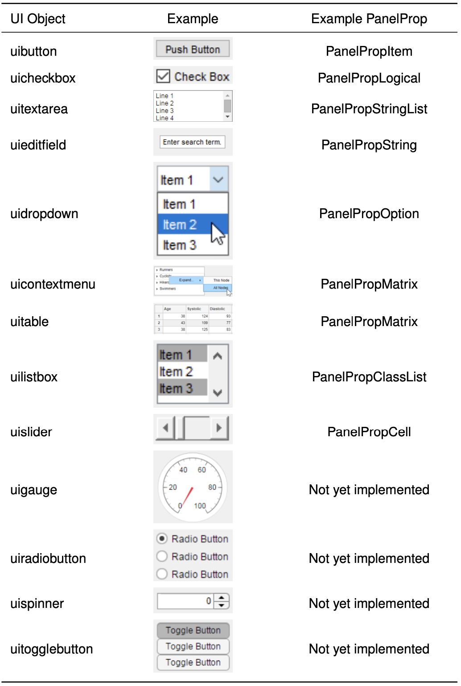

# Implement a New Property Panel

[](dev_panelprop.pdf)

This is the developer tutorial for implementing a new property panel. 
In this tutorial, you will learn how to create the generator file "*.gen.m" for a new property panel, which can then be compiled by `braph2genesis`. 
All property panels are (direct or indirect) extensions of the element `PanelProp`.
You will use the property panel `PanelPropLogical` as an example.
Then, you will be provided with an overview of example property panels using a wide range of UI objects.


## Table of Contents
> [Implementation of property panel (`PanelPropLogical`)](#Implementation-of-property-panel-PanelPropLogical)
>
> [Example property panels for various UI objects](#Example-property-panels-for-various-UI-objects)
>


<a id="Implementation-of-property-panel-PanelPropLogical"></a>
## Implementation of property panel (`PanelPropLogical`)  [⬆](#Table-of-Contents)

To illustrate the general concepts of a property panel, you will start by implementing in detail the property panel `PanelPropLogical`, which is a direct extension of the element `PanelProp`.


> **Code 1.** **PanelPropLogical element header.**
> 		The `header` section of the generator code in "_PanelPropLogical.gen.m" provides the general information about the `PanelPropLogical` element.
> ````matlab
> %% ¡header!
> PanelPropLogical < PanelProp (pr, panel property logical) plots the panel of a property logical.   ①
> 
> %%% ¡description!
> PanelPropLogical plots the panel for a LOGICAL property with a checkbox.
> It works for all categories.  ②
> 
> %%% ¡build!
> 1
> ````
> 
> ① The element `PanelPropLogical` is defined as a subclass of `PanelProp`. The moniker will be `pr`.
> 
> ② Note that more specialized property panels do not necessarily need to work for all categories.
> 


> **Code 2.** **PanelPropLogical element props update.**
> 		The `props_update` section of the generator code in "_PanelPropLogical.gen.m" updates the properties of the `PanelProp` element. This defines the core properties of the property panel.
> ````matlab
> %% ¡props_update!
> 
> . . . . .
> 
> %%% ¡prop!
> EL (data, item) is the element.
> %%%% ¡default!
> PanelProp()  ①
> 
> %%% ¡prop!
> PROP (data, scalar) is the property number.
> %%%% ¡default!
> PanelProp.DRAW  ②
> 
> . . . . .
> ````
> 
> ① and ② define the default element and property for this property panel. This is necessary to ensure that the property panel refers to a property with the right format during unit testing.
> 


> **Code 3.** **PanelPropLogical new props.**
> 		The `props` section of the generator code in "_PanelPropLogical.gen.m" defines the user interface (UI) objects and their callbacks for the `PanelPropLogical` element.
> ````matlab
> %% ¡props!
> 
> %%% ¡prop!
> CHECKBOX (evanescent, handle) is the logical value checkbox.  ①
> %%%% ¡calculate!  ②
> el = pr.get('EL');
> prop = pr.get('PROP');
> 
> checkbox = uicheckbox( ...
>     'Parent', pr.memorize('H'), ... % H = p for Panel
>     'Tag', 'CHECKBOX', ...
>     'Text', '', ...
>     'FontSize', BRAPH2.FONTSIZE, ...
>     'Tooltip', [num2str(el.getPropProp(prop)) ' ' el.getPropDescription(prop)], ...
>     'ValueChangedFcn', {@cb_checkbox} ...
>     );
> 
> value = checkbox;
> %%%% ¡calculate_callbacks!  ③
> function cb_checkbox(~, ~)
>     el = pr.get('EL');  ④
>     prop = pr.get('PROP');  ⑤
> 
>     checkbox = pr.get('CHECKBOX');  ⑥
>     new_value = logical(get(checkbox, 'Value'));  ⑦
> 
>     el.set(prop, new_value)   ⑦
> end
> ````
> 
> ① defines the checkbox needed in the panel for a property logical. Note that this is of category EVANESCENT as it is initialized each time the code is run and is not saved.
> 
> ② initializes the UI object.
> 
> ③ defines the callback function for when the UI object is activated.
> 
> ④ and ⑤ retrieve the element and property on which the callback operates.
> 
> ⑥ retrieves the UI object (in this case, a checkbox) and ⑦ the new value.
> 
> ⑦ writes the new value of the logical property.
> 


> **Code 4.** **PanelPropLogical element props update (continued).**
> 		This continues the update of the `props_update` section of the generator code in "_PanelPropLogical.gen.m". Here, the essential properties to draw and manage the property panel are defined. Importantly, note that all these properties call the parent property calculation to ensure that the panel is correctly managed. This code modifies Code 2.
> ````matlab
> %% ¡props_update!
> 
> . . . . .
> 
> %%% ¡prop!
> X_DRAW (query, logical) draws the property panel.  ①
> %%%% ¡calculate!
> value = calculateValue@PanelProp(pr, PanelProp.X_DRAW, varargin{:}); % also warning
> if value
>     pr.memorize('CHECKBOX')  ②
> end
> 
> %%% ¡prop!
> DELETE (query, logical) resets the handles when the panel is deleted.  ③
> %%%% ¡calculate!
> value = calculateValue@PanelProp(pr, PanelProp.DELETE, varargin{:}); % also warning
> if value
>     pr.set('CHECKBOX', Element.getNoValue())  ④
> end
> 
> %%% ¡prop!
> HEIGHT (gui, size) is the pixel height of the property panel.  ⑤
> %%%% ¡default!
> s(4)
> 
> %%% ¡prop!
> REDRAW (query, logical) resizes the property panel and repositions its graphical objects.  ⑥
> %%%% ¡calculate!
> value = calculateValue@PanelProp(pr, PanelProp.REDRAW, varargin{:}); % also warning
> if value
>     w_p = get_from_varargin(w(pr.get('H'), 'pixels'), 'Width', varargin);
> 
>     set(pr.get('CHECKBOX'), 'Position', [s(.3) s(.3) .70*w_p s(1.75)])  ⑦
> end
> 
> %%% ¡prop!
> UPDATE (query, logical) updates the content and permissions of the checkbox.  ⑧
> %%%% ¡calculate!
> value = calculateValue@PanelProp(pr, PanelProp.UPDATE, varargin{:}); % also warning
> if value
>     el = pr.get('EL');  ⑨
>     prop = pr.get('PROP');  ⑩
> 
>     switch el.getPropCategory(prop)  ⑪
>         case Category.CONSTANT  ⑫
>             set(pr.get('CHECKBOX'), ...
>                 'Value', el.get(prop), ...
>                 'Enable', 'off' ...
>             )
> 
>         case Category.METADATA  ⑬
>             set(pr.get('CHECKBOX'), 'Value', el.get(prop))
> 
>             if el.isLocked(prop)
>                 set(pr.get('CHECKBOX'), 'Enable', 'off')
>             end
> 
>         case {Category.PARAMETER, Category.DATA, Category.FIGURE, Category.GUI}   ⑭
>             set(pr.get('CHECKBOX'), 'Value', el.get(prop))
> 
>             prop_value = el.getr(prop);
>             if el.isLocked(prop) || isa(prop_value, 'Callback')
>                 set(pr.get('CHECKBOX'), 'Enable', 'off')
>             end
> 
>         case {Category.RESULT Category.QUERY Category.EVANESCENT}  ⑮
>             prop_value = el.getr(prop);
> 
>             if isa(prop_value, 'NoValue')
>                 set(pr.get('CHECKBOX'), 'Value', el.getPropDefault(prop))
>             else
>                 set(pr.get('CHECKBOX'), 'Value', el.get(prop))
>             end
> 
>             set(pr.get('CHECKBOX'), 'Enable', 'off')
>     end
> end
> ````
> 
> ① draws the panel. In this case, the property panel contains only a checkbox, whose handle is memorized in ②.
> 
> ③ resets the handles when the property panel and its UI objects are deleted. In this case, it erases the handle of the checkbox in ④.
> 
> ⑤ specifies the height of the property panel. `s(4)` defines the height as  `ceil(4 * BRAPH2.FONTSIZE * BRAPH2.S)`, where `BRAPH2.S` is by default `1`.
> 
> ⑥ draws the property panel determining its graphical appearance. In this case, it just positions the checkbox in ⑦.
> 
> ⑧ updates the status of the UI objects within the panel based on the current state of the element and property to which it is linked. In this case, it just sets the value and permissions of the checkbox.
> 
> ⑨ and ⑩ retrieve the element and property to which the property panel refer.
> 
> ⑪ switches between the different possible property categories to make this property panel work for all of them. More specialized property panels might not need to work for all category, thus simplifying this code.
> 
> ⑫ When the property is a `CONSTANT`, the checkbox is disabled as it cannot be changed.
> 
> ⑬ When the property is a `METADATA`, the `CHECKBOX`'s enabled status depends on whether it is locked.
> 
> ⑭ When the property is `PARAMETER`, `DATA`, `FIGURE`, or `GUI`, the checkbox is enabled only when the property is not locked or a callback.
> 
> ⑮ When the property is `RESULT`, `QUERY`, or `EVANESCENT`, the checkbox is not enabled and it visualizes the default value if the property has not been calculated yet.
> 


<a id="Example-property-panels-for-various-UI-objects"></a>
## Example property panels for various UI objects  [⬆](#Table-of-Contents)

The implementation of `PanelPropLogical` shown in the previous section can be extended to all other user interface (UI) objects. There are several examples already available in the core code of BRAPH 2, each coupled with its corresponding property panel as an example, as shown in the table below. These can be used to guide the realization of new property panels.

