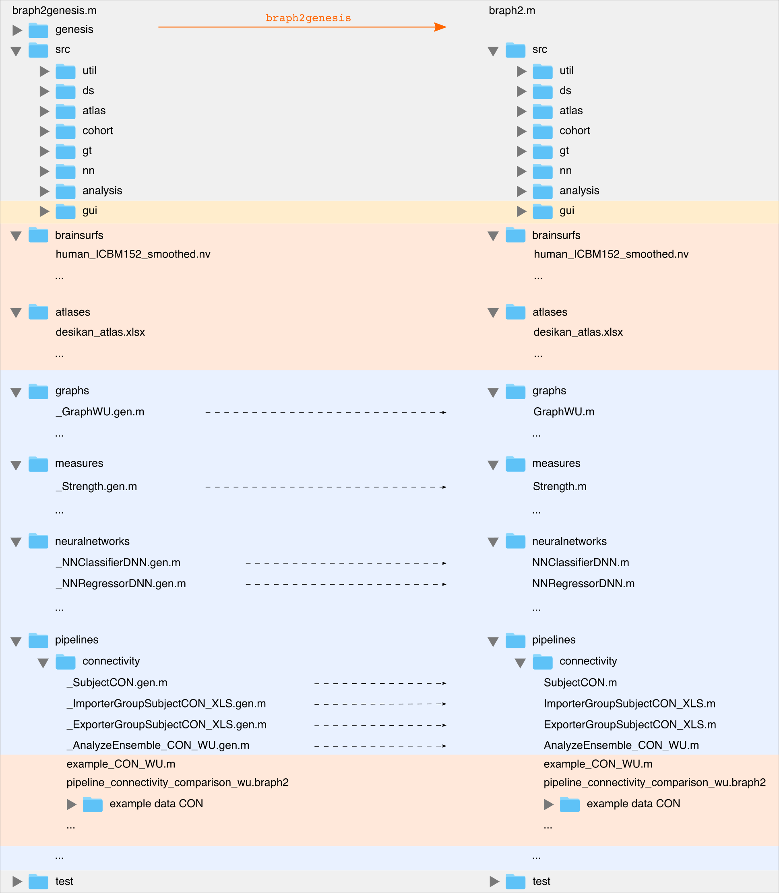

# BRAPH 2.0 — For Developers

Welcome to the BRAPH 2.0 development guide! 

This section provides instructions and examples for developers who want to extend and enhance BRAPH 2.0 with new functionalities. Whether you want to adapt existing pipelines, modify example scripts, or implement completely new features, this guide will walk you through the different levels of complexity in BRAPH 2.0 development.

The software architecture of BRAPH 2.0 provides a clear structure for developers to understand and extend the functionalities of the software. All objects in BRAPH 2.0 are derived from a base object called `Element`. The core code includes the compiler (`genesis`), the essential source code (`src`), and the GUI functionalities (`gui`). Developers can easily add new elements such as brain surfaces, atlases, example scripts, GUI pipelines, graphs, measures, data types, data importers, data exporters, and analyses. By writing new elements and recompiling the code, the new elements and their functionalities are immediately integrated into the GUI.

> 
> **BRAPH 2.0 software architecture.**
Directory structure of BRAPH 2.0 GENESIS (left) and BRAPH 2.0 (right).
All objects are derived from a base object called `Element` and written in a simplified pseudocode (files *.gen.m) that is compiled into the actual elements (files *.m) by the command `braph2genesis` (some examples of these elements are shown).
The compiled code can be launched by the command `braph2`.
The core of BRAPH 2.0 (gray shaded area) includes the compiler (`genesis`), the essential source code (`src`), and the essential functionalities for the GUI (`gui`, yellow-shaded area).
The users can easily add new brain surfaces (`brainsurfs`), atlases (`atlases`), example scripts and GUI pipelines (in the corresponding folder under `pipelines`).
Furthermore, the users can add new elements such as new graphs (e.g., `GraphWU` in `graphs`), measures (e.g., `Strength` in `measures`), data types (e.g., `SubjectCON` in `pipelines/connectivity`), data importers (e.g., `ImporterGroupSubjectCON_XLS` in `pipelines/connectivity`), data exporters (e.g., `ExporterGroupSubjectCON_XLS` in `pipelines/connectivity`), and analyses (e.g., `AnalyzeEnsemble_CON_WU` in `pipelines/connectivity`) by writing new elements and recompiling the whole code: the new elements and their functionalities will be immediately available also in the GUI.
Finally, BRAPH 2.0 is provided with a set of unit tests (executable by the command `test_braph2`) that ensure the formal correctness of the code, including that of any newly added elements.

## Adapting a Pipeline Script

The simplest way to customize BRAPH 2.0 is by modifying a .braph2 pipeline script. This permits one to define parameters and adjust the analysis steps according to their specific requirements. The [Developer Tutorial to Adapt a Pipeline Script](tutorials/developers/devdoc_pipeline.pdf) provides guidance on adapting pipeline scripts.

## Editing an Example Script

Developers can also edit the example scripts provided with the software to have more control over the analysis workflow and leverage parallel computing for faster calculations. For example, these scripts can be used to run calculations on a cluster. The developer tutorial <a href="https://github.com/giovannivolpe/BRAPH-2-Matlab-beta/blob/develop/tutorials/developers/devdoc_script_measure.pdf">Calculating Different Measures</a> demonstrates how to modify example scripts.

## Expanding BRAPH 2.0 with New Functionalities

BRAPH 2.0's object-oriented programming architecture makes it easy to expand its capabilities by introducing new elements and features. Here are some of the ways you can extend BRAPH 2.0:

- **Graphs**: Developers can implement new graph types by extending the `Graph` element. The [Developer Tutorial to Implement a New Graph](tutorials/developers/devdoc_graph.pdf) provides a step-by-step guide on how to create new graph types.

- **Measures**: New measures can be added to BRAPH 2.0 by extending the `Measure` element. The [Developer Tutorial to Implement a New Measure](tutorials/developers/devdoc_measure.pdf) explains the process of implementing custom measures.

- **Subjects**: Developers can introduce new data types by extending the `Subject` element. The tutorial [Developer Tutorial to Implement a New Subject](tutorials/developers/devdoc_subject.pdf) provides guidance on creating new data types for subjects.

- **Group-based and Ensemble-based Analyses**: New analysis pipelines can be added to BRAPH 2.0 by extending the `AnalysisGroup` or `AnalysisEnsemble` elements. The tutorials in this category demonstrate the process of implementing new analysis pipelines:
  - [Developer Tutorial to Implement a New Group Analysis](tutorials/developers/devdoc_analysis_group.pdf)
  - [Developer Tutorial to Implement a New Ensemble Analysis](tutorials/developers/devdoc_analysis_ensemble.pdf)

- **Deep-learning Functionalities**: New functionalities for deep-learning analyses can be swiftly integrated into BRAPH 2.0 as well. Here are the tutorials for expanding BRAPH 2.0 with deep-learning features:
  - [Developer Tutorial to Implement a New Neural Network Classifier](tutorials/developers/devdoc_nn_clas.pdf)
  - [Developer Tutorial to Implement a New Neural Network Regressor](tutorials/developers/devdoc_nn_reg.pdf)
  - [Developer Tutorial to Implement a New Neural Network Evaluator for Classification](tutorials/developers/devdoc_nn_clas_eval.pdf)
  - [Developer Tutorial to Implement a New Neural Network Evaluator for Regression](tutorials/developers/devdoc_nn_reg_eval.pdf)

- **Analysis Pipelines**: Developers can also contribute to the evolution of BRAPH 2.0 by introducing new analysis pipelines tailored to specific research requirements. The [Developer Tutorial to Implement a New Analysis Pipeline](tutorials/developers/devdoc_new_pipeline.pdf) provides a comprehensive guide on creating custom analysis pipelines within the BRAPH framework. This tutorial covers the entire pipeline development process, including data handling, calculation of measures, statistical analysis, and results visualization. By developing new analysis pipelines, users can enhance the capabilities of BRAPH 2.0 and enable the exploration of novel analytical approaches.

These tutorials provide step-by-step instructions and examples to guide developers in expanding BRAPH 2.0 with new functionalities. We encourage developers to contribute to the growth and improvement of BRAPH 2.0 by introducing new elements, measures, and analyses. Feel free to share your implementations, ask questions, and engage with the BRAPH community through the [BRAPH forum](http://braph.org/forums) and [GitHub page](https://github.com/softmatterlab/BRAPH-2-Matlab).

Happy developing!
