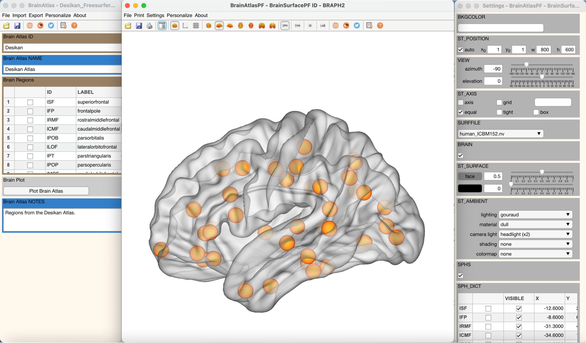
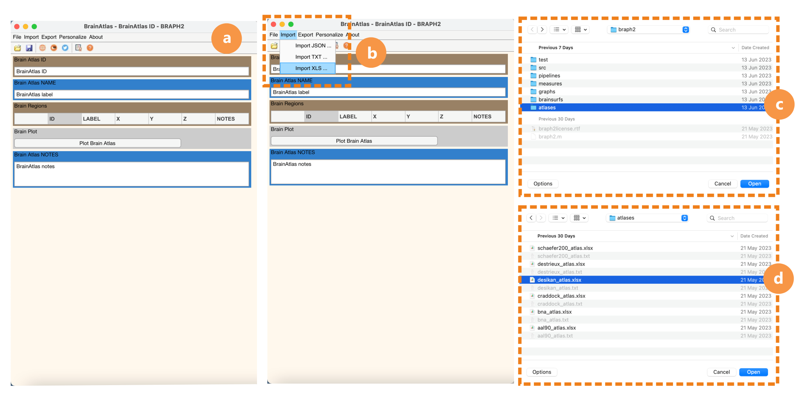

# Brain Atlas

> 
> Example of a brain surface image with some nodes representing brain regions.*

## Abstract

This Tutorial explains how to work with the Graphical User Interface (GUI) to manage brain atlases. This is typically the first step required to perform a graph analysis in BRAPH 2.0. In this Tutorial, we will explain how to upload a brain atlas, how to visualize it, and how to export publication-ready brain figures.


*Full graphical user interface to work with a brain atlas in BRAPH 2.0.*

## Open the GUI

The brain atlas GUI is the first step in most BRAPH 2.0 pipelines. You can open it by typing `braph2` in the MatLab's terminal, which allows you to select a pipeline containing the steps required to perform your analysis. The initial step is typically to upload the brain atlas, as shown in the figure below.


*The different steps you need to follow to open a brain atlas using the GUI:*
- Open the brain atlas GUI.
- Import a brain atlas from an XLS or TXT file.
- Navigate to the BRAPH 2.0 folder `atlases`.
- Select the desired atlas.

To open the GUI and upload the brain atlas, you can also do it from the command line (i.e., without opening an analysis pipeline) by typing the following commands:

```matlab
ba = BrainAtlas();  % creates a new object `BrainAtlas`.
gui = GUIElement('PE', ba);  % creates a GUI to upload the brain atlas.
gui.get('DRAW');  % draws the GUI.
gui.get('SHOW');  % shows the GUI.
