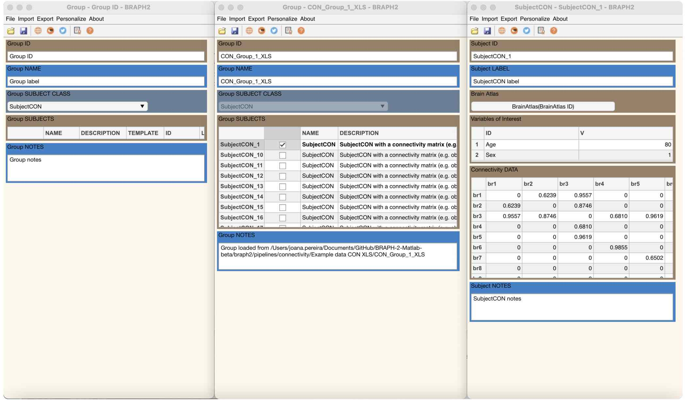
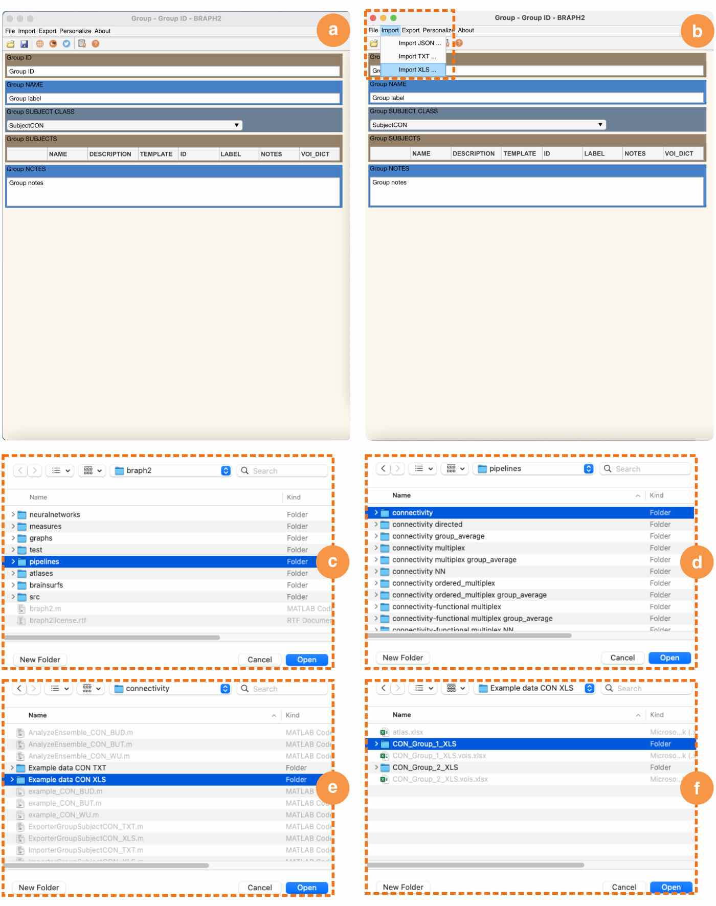
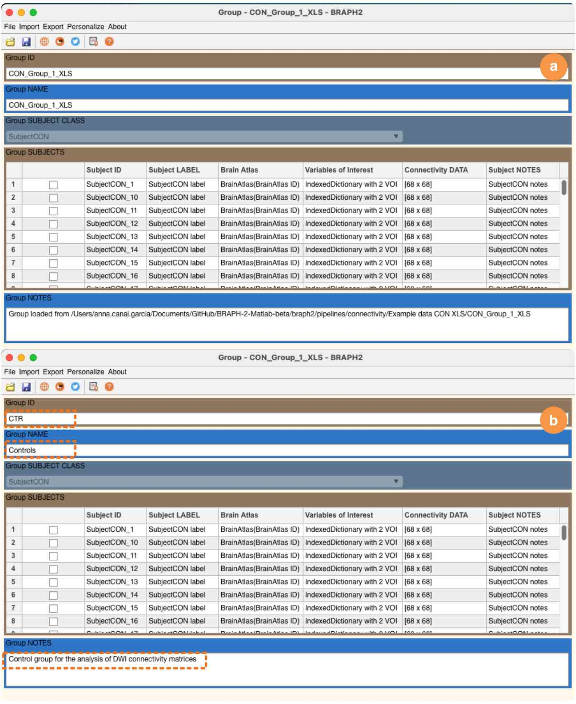
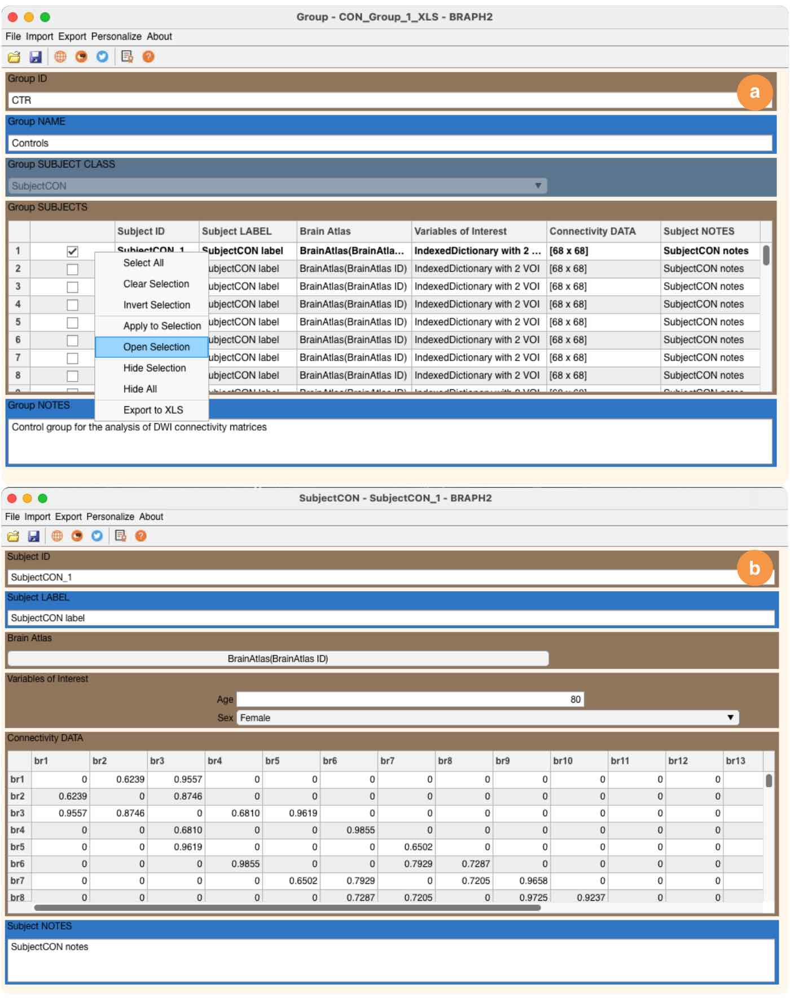
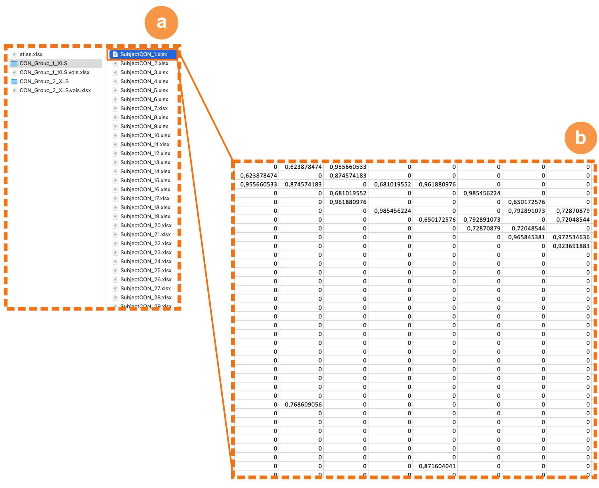
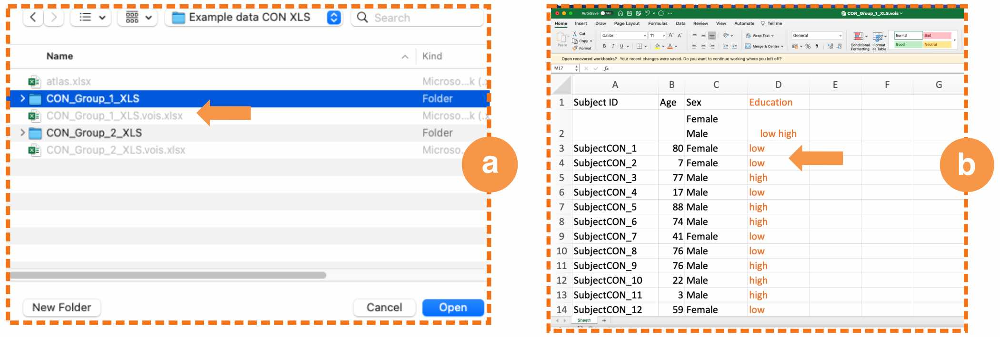

# Group of Subjects with Connectivity Data

[](tut_gr_con.pdf)

For *connectivity data*, a connectivity matrix per subject is already available and can be directly imported into the relative analysis pipeline. For example, the connectivity matrix could correspond to white matter tracts obtained from dMRI or pre-calculated coactivations maps obtained from fMRI data.
This Tutorial explains how to prepare and work with this kind of data.


> 
> **Figure 1. GUI for a group of subjects with connectivity data.**
> Full graphical user interface to upload a group of subjects with connectivity data in BRAPH 2.0.

## Generation of Example Data

If you don't have the `Example data CON XLS` folder inside `connectivity`, then you can generate it by running the commands referenced below.

```matlab
create_data_CON_XLS()  % generates the example connectivity XLS data folder.
create_data_CON_TXT()  % generates the example connectivity TXT data folder.
```

## Open the GUI

In most analyses, the group GUI is the second step after you have selected a brain atlas. You can open it by typing `braph2` in MatLab's terminal, which allows you to select a pipeline containing the steps required to perform your analysis and upload a brain atlas. After these steps have been completed you can upload your group's data directly (Figure 2c-f) after clicking "Load Group". 


> 
> **Figure 2. Upload the data of a group of subjects.**
> Steps to upload a group of subjects with connectivity data using the GUI and an example dataset:
> **a** Open the group GUI.
> **b** Import a folder containing the connectivity matrices in XLS or TXT format (see below for details on their format).
> To upload the test connectivity data:
> **c-f** navigate to the BRAPH 2.0 folder `pipelines`, **d** `connectivity`, **e** `Example data CON XLS`, and **f** select the folder containing the connectivity matrices of one group `CON_Group_1_XLS`.

> **GUI launch from command line**
> 
> You can also open the GUI and upload the brain connectivity data using the command line (i.e., without opening an analysis pipeline) by typing the commands referenced below. In this case, you can upload the data as shown in Figure 2a-f.
>
> Commands to open the GUI and upload the brain connectivity data:
>
> ```matlab
> gr = Group('SUB_CLASS', 'SubjectCON');  % creates a new object Group with subjects with connectivity data, i.e., SubjectCON.
> 
> gui = GUIElement('PE', gr);  % creates a GUI to upload the group data.
> gui.get('DRAW');  % draws the GUI.
> gui.get('SHOW');  % shows the GUI.
> ```

## Visualize the Group Data

After completing the steps described in the Figure 2, you can see the data as shown in Figure 3a, and change the Group ID, name, and notes as in Figure 3b.


> 
> **Figure 3. Edit the group metadata.** 
> **a** The GUI of the group's connectivity data.
> **b** The information you see on this GUI that can be changed. In this example, we have edited the ID, name, and notes of the group but can also change the subject's specific information.

## Visualize Each Subject's Data

Finally, you can open each subject's connectivity matrix by selecting the subject, right-click, and select "Open selection" as shown in Figure 4a, which displays the matrix values in Figure 4b. Here, you can also change the subject's metadata (ID, label, notes), its variables of interest, and the values of its connectivity matrix.


> 
> **Figure 4. Edit the individual subject data.** 
> **a** Each subject's connectivity matrix can be opened by selecting the subject, right-click, and select "Open selection".
> **b** In this subject GUI, it is possible to view and edit the metadata of the subject (ID, label, notes), its variables of interest (in this case, age and sex), and the values of the connectivity matrix.

## Preparation of the Data to be Imported

To import connectivity data into BRAPH 2.0, you need to have the connectivity matrices for each subject in either excel or text format inside a folder named after the group. The structure of your group directory and an example of a brain connectivity matrix are shown below.


>
> **Figure 5. Data preparation.**
> The data organization should follow this format:
> **a** Connectivity matrices for each subject should be housed in one folder, e.g., `CON_group_1_XLS`.
> **b** Each matrix should detail the connectivity values between each pair of brain regions, as indicated by the rows and columns. For instance, the (simulated) values in this matrix represent the fractional anisotropy (white matter integrity) of anatomical connections sourced from diffusion-weighted imaging.

## Adding Covariates

When analyzing data, it's a common practice to incorporate *variables of interest*, which can be *covariates* or *correlates*. In BRAPH 2.0, these variables of interest must be stored in a separate excel file located just outside the group's folder. The file should share the group folder's name, but with a `.vois` extension, as shown in Figure 6a. The file must adhere to a specific format outlined in Figure 6b:

- **Subject IDs (column A).** Starting from row 3, column A should list the subject IDs.
  
- **Variables of interest (column B and subsequent columns).** Column B and the following columns should contain the variables of interest, one per column. Using this example, we see variables like "Age" and "Sex", along with an additional "Education" variable. For each column:
  - Row 1: The name of the variable of interest.
  - Row 2: Categories separated by a return (only for categorical variables of interest, like "Sex" and "Education").
  - Subsequent rows: The values of the variable of interest for each subject.


>
> **Figure 6. Edit the Covariates.**
> The editable information in the Covariates file includes:
> **a** The names of the variables of interest (vois).
> **b** For categorical vois, you can specify the categories they belong to.

