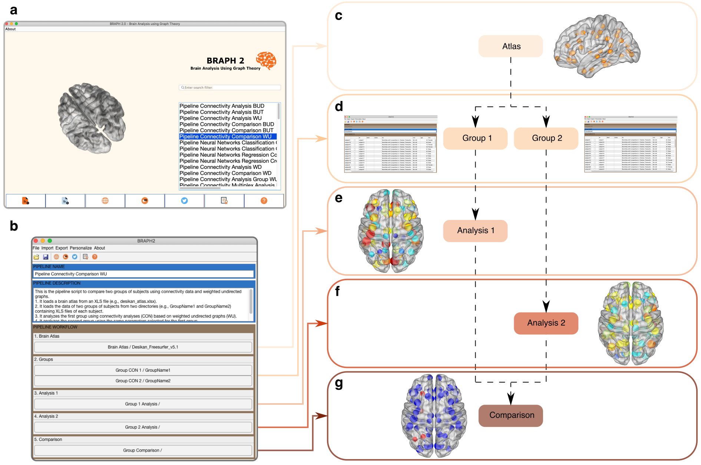
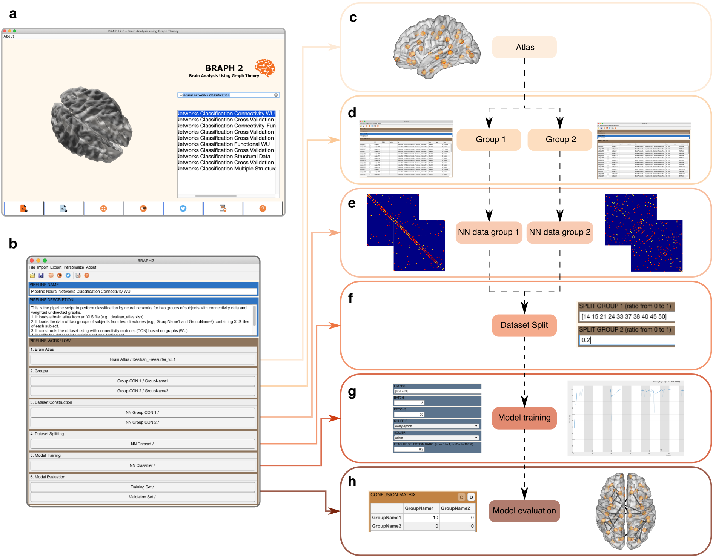

# BRAPH 2 - Pipelines

This section provides detailed instructions on how to use the BRAPH 2 data analysis pipelines using Graphical User Interfaces (GUIs).

## Single Layer Connectivity Pipelines

These tutorials provide step-by-step instructions for analyzing and comparing connectivity measures using different single layer connectivity pipelines:

- **Pipelines analyzing connectivity data (CON).** For connectivity data, a connectivity matrix per subject is already available and can be directly imported into the relative analysis pipeline. For example, the connectivity matrix could correspond to white matter tracts obtained from dMRI or pre-calculated coactivations maps obtained from fMRI data.
  - [Pipeline Connectivity Comparison WU](tut_a_con_wu): Tutorial to compare two groups of subjects with connectivity data (CON) using weighted undirected (WU) graphs.
  - [Pipeline Connectivity Comparison BUD](tut_a_con_bud): Tutorial to compare two groups of subjects with connectivity data (CON) using binary undirected graphs at fixed densities (BUD).
  - [Pipeline Connectivity Comparison BUT](tut_a_con_but): Tutorial to compare two groups of subjects with connectivity data (CON) using binary undirected graphs at fixed thresholds (BUT).

- **Pipelines analyzing functional data (FUN).** In functional data, a time series representing brain function over time is available for each brain region of each subject. For example, these time series could be brain activation signals in fMRI or electrophysiological signals in electroencephalography (EEG) or magnetoencephalography (MEG). 
  - [Pipeline Functional Comparison WU](tut_a_fun_wu): Tutorial to compare two groups of subjects with functional data (FUN) using weighted undirected (WU) graphs.
  - [Pipeline Functional Comparison BUD](tut_a_fun_bud): Tutorial to compare two groups of subjects with functional data (FUN) using binary undirected graphs at fixed densities (BUD).
  - [Pipeline Functional Comparison BUT](tut_a_fun_but): Tutorial to compare two groups of subjects with functional data (FUN) using binary undirected graphs at fixed thresholds (BUT).

- **Pipelines analyzing structural data (ST).** In structural data, a scalar value is available for each brain region of each subject. For example, these could correspond to gray matter volume or thickness in T1-weighted MRI, brain perfusion in ASL or abnormal protein deposition in static PET data.
  - [Pipeline Structural Comparison WU](tut_a_st_wu): Tutorial to compare two groups of subjects with structural data (ST) using weighted undirected (WU) graphs.
  - [Pipeline Structural Comparison BUD](tut_a_st_bud): Tutorial to compare two groups of subjects with structural data (ST) using binary undirected graphs at fixed densities (BUD).
  - [Pipeline Structural Comparison BUT](tut_a_st_but): Tutorial to compare two groups of subjects with structural data (ST) using binary undirected graphs at fixed thresholds (BUT).

> 
> **BRAPH~2.0 graph analysis pipeline.**
> **a** Main graphical user interface (GUI) for BRAPH 2, which is launched by the command `braph2`, where an analysis pipeline can be selected.
> **b** GUI of the *Pipeline Comparison Connectivity WU*, which allows the user to import weighted undirected (WU) adjacency matrices corresponding to two subject groups and compare the distributions of the subjects' graph measures. This pipeline consists of sequential steps: 
> **c** Load the brain atlas.
> **d** Load the two groups of subject data.
> **e** Analyze the first group.
> **f** Analyze the second group.
> **g** Compare the two groups to identify statistically significant differences.

## Multiplex Connectivity Pipelines

These tutorials guide you through the analysis and comparison steps of multiplex connectivity pipelines. Explore the following pipelines to analyze and compare multiplex connectivity measures:

- **Pipelines analyzing connectivity multiplex data (CON).** Multilayer connectivity data comprises multiple layers of connectivity information, where each layer represents a distinct aspect of connectivity, such as different frequency bands or connectivity at different time points. This data type enables the investigation of time-varying or multiplex brain networks, and it can be sourced from various connectivity matrices per subject, such as white matter tracts obtained from dMRI or pre-calculated coactivation maps derived from fMRI data.
  - [Pipeline Connectivity Multiplex Comparison WU](tut_a_mp_con_wu): Tutorial to compare two groups of subjects with connectivity multiplex data (CON MP) using weighted undirected (WU) graphs.
  - [Pipeline Connectivity Multiplex Comparison BUD](tut_a_mp_con_bud): Tutorial to compare two groups of subjects with connectivity multiplex data (CON MP) using binary undirected graphs at fixed densities (BUD).
  - [Pipeline Connectivity Multiplex Comparison BUT](tut_a_mp_con_but): Tutorial to compare two groups of subjects with connectivity multiplex data (CON MP) using binary undirected graphs at fixed thresholds (BUT).

- **Pipelines analyzing functional multiplex data (FUN).** Functional multiplex data encompasses time series representing brain function over time for each brain region of each subject. This data type includes brain activation signals obtained from fMRI or electrophysiological signals from techniques such as electroencephalography (EEG) or magnetoencephalography (MEG). These time series capture the dynamics of brain activity and facilitate the investigation of functional connectivity patterns across multiple layers.
  - [Pipeline Functional Comparison WU](tut_a_mp_fun_wu): Tutorial to compare two groups of subjects with functional multiplex data (FUN MP) using weighted undirected (WU) graphs.
  - [Pipeline Functional Comparison BUD](tut_a_mp_fun_bud): Tutorial to compare two groups of subjects with functional multiplex data (FUN MP) using binary undirected graphs at fixed densities (BUD).
  - [Pipeline Functional Comparison BUT](tut_a_mp_fun_but): Tutorial to compare two groups of subjects with functional multiplex data (FUN MP) using binary undirected graphs at fixed thresholds (BUT).

- **Pipelines analyzing structural multiplex data (ST).** Structural multiplex data provides a scalar value for each brain region of each subject, offering insights into the anatomical characteristics of the brain. This data type includes measurements such as gray matter volume or thickness obtained from T1-weighted MRI, brain perfusion from arterial spin labeling (ASL) imaging, or abnormal protein deposition from static positron emission tomography (PET) data. Structural multiplex data enables the exploration of anatomical variations across multiple layers and their potential correlations with brain function.
  - [Pipeline Structural Comparison WU](tut_a_mp_st_wu): Tutorial to compare two groups of subjects with structural multiplex data (ST MP) using weighted undirected (WU) graphs.
  - [Pipeline Structural Comparison BUD](tut_a_mp_st_bud): Tutorial to compare two groups of subjects with structural multiplex data (ST MP) using binary undirected graphs at fixed densities (BUD).
  - [Pipeline Structural Comparison BUT](tut_a_mp_st_but): Tutorial to compare two groups of subjects with structural multiplex data (ST MP) using binary undirected graphs at fixed thresholds (BUT).

## Deep Learning Pipelines

These tutorials demonstrate the use of neural networks for regression and classification tasks on different types of data:
- [Pipeline Neural Network Regression ST](tut_nn_reg_st): Tutorial that uses neural networks for regression using structural data (ST).
- [Pipeline Neural Network Classification Connectivity BUD Graphs](tut_nn_clas_con_bud_g): Tutorial that uses neural networks to classify binary undirected graphs obtained from connectivity at fixed densities (BUD).
- [Pipeline Neural Network Classification with Connectivity WU Data](tut_nn_clas_con_wu): Tutorial that uses neural networks for classification using weighted undirected (WU) connectivity data.
- [Pipeline Neural Network Classification Cross Validation with Functional WU Data](tut_nn_clas_fun_wu_xval): Tutorial that uses neural networks for classification with cross-validation using weighted undirected (WU) functional connectivity data.

> 
> **BRAPH 2 deep-learning analysis pipeline.**
> **a** Main graphical user interface (GUI) for BRAPH 2, which is launched by the command `braph2`, where an analysis pipeline can be selected.
> **b** GUI of the *Pipeline Neural Networks Classification Connectivity WU*, which permits the user to import weighted undirected (WU) adjacency matrices corresponding to two subject groups and perform classification using either the subjects' graph measures or their adjacency matrices. This pipeline consists of sequential steps:
> **c** Load the brain atlas.
> **d** Load the two groups of subject data.
> **e** Construct the dataset.
> **f** Split the dataset.
> **g** Train the neural network model.
> **h** Evaluate the performance of the model using confusion matrices, the area under the receiver operating characteristic curve, and a feature importance analysis.

### Custom Analysis Pipelines

In addition to the existing analysis pipelines, BRAPH 2 allows users to develop custom analysis pipelines tailored to their specific research needs. This flexibility expands the range of brain analysis techniques that can be implemented using BRAPH 2.

If the specific analysis you wish to perform is not currently supported by BRAPH 2, you have two options:

1. **Further Development**: You can develop the necessary functionalities to implement your custom analysis pipeline by following the [Tutorial to Implement a New Analysis Pipeline](../developers/dev_pipeline). This tutorial provides guidance on extending BRAPH 2 to accommodate new analysis techniques, enabling you to seamlessly integrate your pipeline into the BRAPH framework.

2. **Feature Request**: If you prefer not to develop the functionalities yourself, you can consider opening an issue on the BRAPH GitHub repository. Use the [Feature Request](../../../../issues/new/choose) template to describe your specific analysis requirements and the desired functionality. The BRAPH development team and community can review your request and potentially incorporate it into future updates of BRAPH.

By offering the ability to create custom analysis pipelines, BRAPH 2 empowers users to explore innovative approaches and advance the field of brain connectivity analysis.

