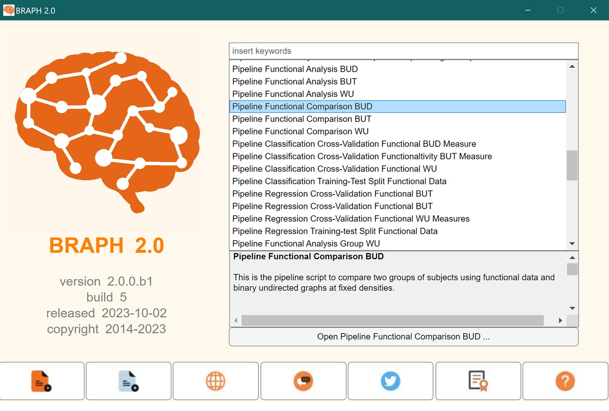
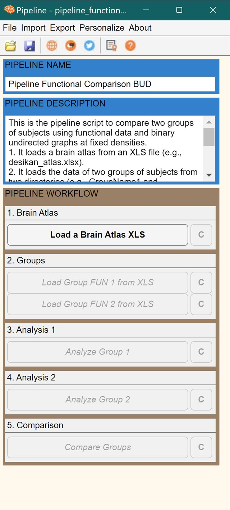
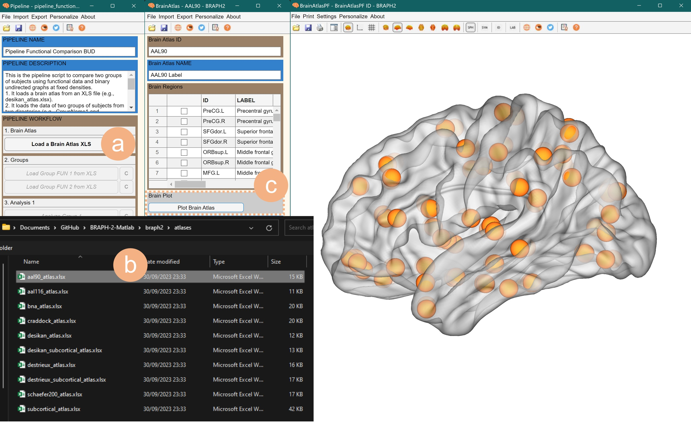
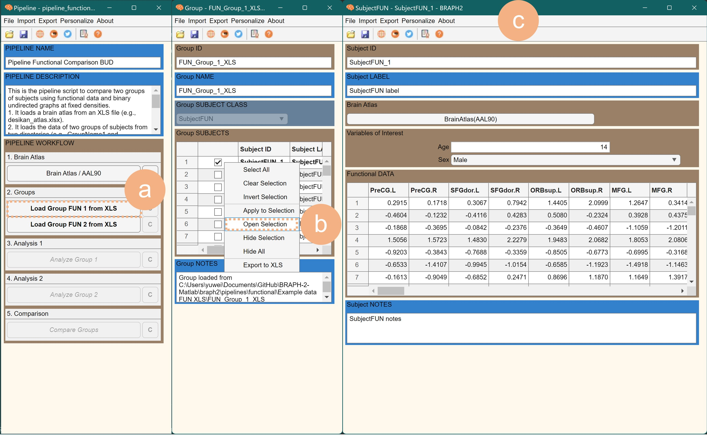
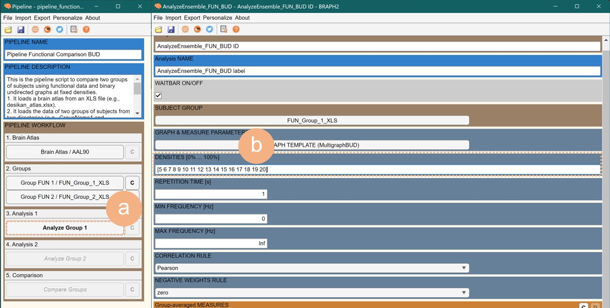
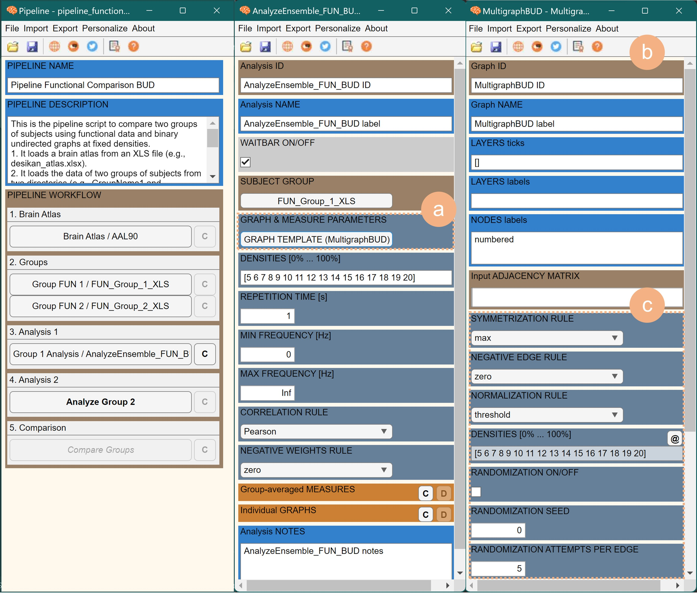
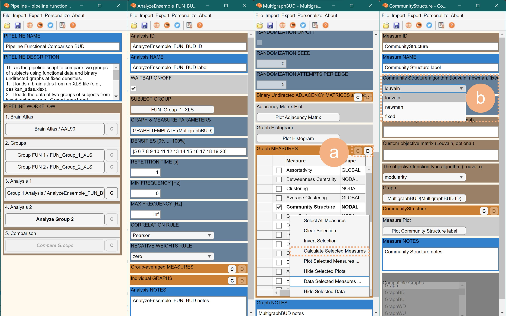
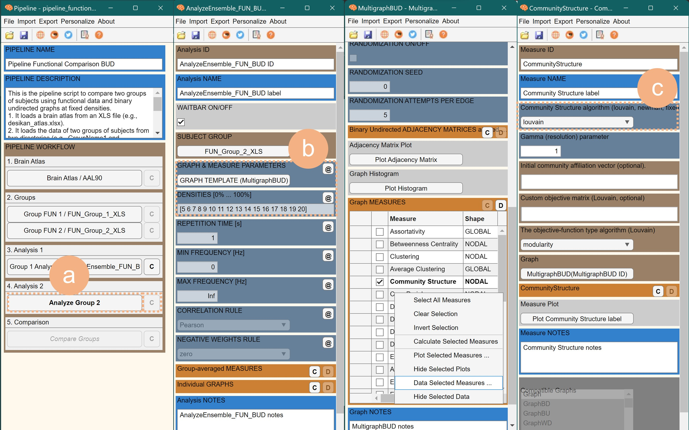

# Pipeline for Comparison of Connectivity Data using Binary Undirected Graphs at Fixed Densities

[](tut_a_fun_bud.pdf)

This tutorial shows how to perform a network analysis using *functional data* (see tutorial [Group of Subjects with Functional Data](https://github.com/braph-software/BRAPH-2/tree/develop/tutorials/data/tut_gr_fun)), where a functional file containing activation signals for each brain region is available for each subject, as in functional MRI, MEG, or EEG. Step by step, this pipeline guides you to compare the data from two groups of subjects at fixed densities, which correspond, for example, to fixed percentages of strongest connections to be included in the analysis (e.g., fixing the analysis at 10\% allows assessing the 10\% strongest connections in the network).  With this tutorial, you will be able to extract and plot differences between two groups. You will also be able to generate publication-quality figures.


> **Figure 1. Figure examples**
> Examples of displays of `Community Structure` with functional data binarized at fixed densities obtained using BRAPH 2.

## Table of Contents
> [Generate Example Data](#Generate-Example-Data)
>
> [Open the GUI](#Open-the-GUI)
>
> [Step 1: Load the Brain Atlas](#Step-1-Load-the-Brain-Atlas)
>
> [Step 2: Load the Functional Group Data](#Step-2-Load-the-Functional-Group-Data)
>
> [Step 3: Analyzing the Data of Group 1](#Step-3-Analyzing-the-Data-of-Group-1)
>
>> [Setting Analysis Parameters](#Setting-Analysis-Parameters)
>>
>> [Setting Graph Parameters](#Setting-Graph-Parameters)
>>
>> [Setting Measure Parameters](#Setting-Measure-Parameters)
>>
>> [Calculate Measures](#Calculate-Measures)
>>
> [Step 4: Analyzing the Data of Group 2](#Step-4-Analyzing-the-Data-of-Group-2)
>
> [Step 5: Comparing Groups](#Step-5-Comparing-Groups)
>


<a id="Generate-Example-Data"></a>
## Generate Example Data  [⬆](#Table-of-Contents)

You can generate the example data by typing in the command line the instruction in Code 1.


> **Code 1.** **Command to generate example data.**
> 		Command to generate the example data for functional analyses. They will be placed in the folder "./braph2/pipelines/functional/Example data FUN XLS", and include the brain atlas "atlas.xlsx", two folders with the subject files "FUN_Group_1_XLS" and "FUN_Group_2_XLS", and the associated covariates files "FUN_Group_1_XLS.vois.xlsx" and "FUN_Group_2_XLS.vois.xlsx". The details about the format of these files can be found in the tutorials [Brain Atlas](https://github.com/braph-software/BRAPH-2/tree/develop/tutorials/data/tut_ba) and [Group of Subjects with Functional Data](https://github.com/braph-software/BRAPH-2/tree/develop/tutorials/data/tut_gr_fun).
> ````matlab
> create_data_FUN_XLS()
> ````
> 

<a id="Open-the-GUI"></a>
## Open the GUI  [⬆](#Table-of-Contents)

The general GUI of BRAPH 2 can be opened by typing `braph2` in MatLab's terminal. This GUI allows you to select a pipeline, in this case, *Pipeline Functional Comparison BUD*, as shown in Figure 2.




> **Figure 2. BRAPH 2 main GUI**
> BRAPH 2 main GUI with the pipeline *Pipeline Functional Comparison BUD* selected.


> **Pipeline launch from command line**
> To open the GUI and upload the functional comparison pipeline, you can use the command line by typing the commands in Code 2.
> 
> 
> > **Code 2.** **Code to launch the GUI to upload a pipeline file to compare two groups of subjects.**
> > 		This code can be used in the MatLab command line to launch the GUI to upload a pipeline file.
> > ````matlab
> > im = ImporterPipelineBRAPH2( ...
> >     'FILE', which('pipeline_functional_comparison_BUD.braph2') ...
> >     );
> > pip = im.get('PIP');
> > 
> > gui = GUIElement('PE', pip, 'WAITBAR', true)
> > gui.get('DRAW')
> > gui.get('SHOW')
> > ````
> >

Once the pipeline is uploaded, you can see a GUI that contains different steps to: upload a brain atlas, upload the functional data of two groups, analyze them, and finally, compare the groups (Figure 3). 




> **Figure 3. Pipeline steps**
> These are the steps of the pipeline. Only the first step is active when the pipeline is first opened. Subsequent steps will become active sequentially.


<a id="Step-1-Load-the-Brain-Atlas"></a>
## Step 1: Load the Brain Atlas  [⬆](#Table-of-Contents)

Figure 4 shows how to upload and plot the brain atlas that you used to extract the data for your analysis. For more information on where to find different atlases or how to change plotting settings on the brain surface, check the tutorial [Brain Atlas](https://github.com/braph-software/BRAPH-2/tree/develop/tutorials/data/tut_ba).




> **Figure 4. Uploading the Brain Atlas**
> Steps to upload the brain atlas:
> 	**a** Click on "Load Atlas" from the pipeline GUI.
> 	**b** Navigate to the BRAPH 2 folder "atlases" and select one of the atlas files, in this example the "aal90_atlas.xlsx". 
> 	**c** You can visualize the brain atlas by pressing "Plot Brain Atlas".
	

<a id="Step-2-Load-the-Functional-Group-Data"></a>
## Step 2: Load the Functional Group Data  [⬆](#Table-of-Contents)

After you have loaded the brain atlas, you can upload the *functional data* for each group as shown in Figure 5. A new interface will be shown containing the data for the group you just selected. You can open each subject’s functional matrices by selecting the subject, right click, and select “Open selection” (for more information check the tutorial [Group of Subjects with Functional Data](https://github.com/braph-software/BRAPH-2/tree/develop/tutorials/data/tut_gr_fun)).




> **Figure 5. Loading and visualizing the group data**
> **a** From the pipeline GUI, click on "Load Group FUN 1 from XLS" to load the data of group 1.
> 	**b** Once the data is uploaded, you can select a subject, right click and select "Open selection".
> 	**c** This will open the functional matrix of the subject in addition to the age and sex of that subject (which are the variables of interest available for the example data).
> 	You can then repeat the same procedure for group 2.


<a id="Step-3-Analyzing-the-Data-of-Group-1"></a>
## Step 3: Analyzing the Data of Group 1  [⬆](#Table-of-Contents)

Once you have loaded the data for both groups, you can begin analyzing the data for the first group by clicking on "Analyze Group 1" (Figure 6a). 
This will open a new interface called "Analyze Ensemble", which allows you to calculate and visualize graph measures for the first group. 
Before these network measures are calculated, it is important to ensure the following things: 


- The analysis parameters are set correctly (e.g., the densities).

- The graph parameters are set correctly.

- The measures are configured with the parameters you desire (note that not all measures have parameters).


Importantly, the parameters you select at the beginning will remain fixed for the rest of pipeline to ensure the consistency of the analysis (including the analysis of the second group and the comparison between groups). We will now guide you through the process of preparing these parameters for both measures and graphs. It is important to keep in mind that the default parameters should work well for most cases.

<a id="Setting-Analysis-Parameters"></a>
### Setting Analysis Parameters  [⬆](#Table-of-Contents)

In the "Analyze Ensemble" interface (Figure 6b), you can configure the analysis parameters.
In the `densities` section, you can define the densities by entering values like `5:1:20` (you can also use any other valid mathematical expression, such as `5 10 15 20 15`, or `5 10:2:20`).
In the `REPETITION TIME [s]` section, you can include the repetition time with which your images were acquired, for example to analyze the data only within a fraction of the repetition time.
In the `MIN FREQUENCY [Hz]` and `MAX FREQUENCY [Hz]`, you can edit the values to analyze your data within a certain frequency band such as in the case of EEG or MEG data.
In the `correlation rule`, you can select the type of correlation you want to run using the brain activation signals between brain areas. 
Finally, in the `NEGATIVE WEIGHTS RULE`, you should decide if you want to set the negative weights to zero, their absolute values or exclude them from the analysis since graph theory measures are not defined for negative weights.




> **Figure 6. Configuring analysis parameters**
> **a** To initiate the analysis of data for group 1, click on "Analyze Group 1".
> 	**b** You define the densities in the `densities` section.

<a id="Setting-Graph-Parameters"></a>
### Setting Graph Parameters  [⬆](#Table-of-Contents)

To configure the graph parameters, you click on the section `GRAPH & MEASURE PARAMETERS` (Figure 7). This will open a new interface for graph template settings. 
In brain functional analysis, density values dictate the required connection density between different brain regions for them to be considered “connected” in a binary undirected graph. 
Adjusting these densities allows you to explore varying levels of brain functional connectivity, providing insights into how regions communicate at different density settings.




> **Figure 7. Configuring Graph Parameters**
> **a** By clicking on the section `GRAPH & MEASURE PARAMETERS`, you open **b** a new interface that permits you to configure the graph parameters.
> 	**c** The available parameters shall be set at this point.

The available parameters are:


- `SYMMETRIZATION RULE` determines how to symmetrize the matrix.

- `NEGATIVE EDGE RULE` determines how to remove the negative edges.

- `NORMALIZATION RULE` determines how to normalize the weights between 0 and 1.

- `DENSITIES [0\% ... 100\%]` determines the densities. *This cannot be set here. It is set in the previous step.*

- `RANDOMIZE ON/OFF` determines whether to randomize the graph. *Typically not used*

- `RANDOM SEED` is the randomization seed. *Typically not used*

- `RANDOMIZATION ATTEMPTS PER EDGE` is the attempts to rewire each edge. *Typically not used*


<a id="Setting-Measure-Parameters"></a>
### Setting Measure Parameters  [⬆](#Table-of-Contents)

Now, if you scroll down to find the `Graph MEASURES` section, by clicking on the `C` button, all compatible measures will be displayed in a table. 
For example, you can select the `Community Structure` measure and then right-click at the top of the table (Figure 8a). 
In the right-click menu, choose `Data Selected Measures`. 
This will open the measure window, allowing you to specify the rules or parameters (Figure 8b).




> **Figure 8. Configuring Measure Parameters**
> **a** Expanding the `Graph MEASURES` panel, by clicking on the `C` button, reveals a table displaying all compatible measures. 
> 	Select the `Community Structure` measure and then right-click at the top of the table. In the right-click menu, choose `Data Selected Measures`.
> 	**b** The measure window that opens allows you to define the parameters for the `Community Structure` measure. Select the `louvain` algorithm to calculate it.


<a id="Calculate-Measures"></a>
### Calculate Measures  [⬆](#Table-of-Contents)
 
After configuring the parameters, you can proceed to calculate specific graph measures (Figure 9). To do this, return to the "Analyze Ensemble" interface (Figure 9a) and scroll down to locate the "Group-averaged MEASURES" panel. By clicking the `C` button, you will see a table displaying all measures.


> **Figure 9. Analyzing the Group Data**
> **a** Locate the `Group-averaged MEASURES` panel and click the `C` button to see all available measures. Choose the `Community Structure` measure, right-click it, and select `Calculate Selected Measures` to perform the calculation.
> 	**b** To visualize the results, right-click on the top of the table and choose `Plot Selected Measures on Brain` in the Analyze Ensemble interface. This action opens a brain surface with the `Community Structure` plotted.
> 	**c** Adjust visualization settings by clicking on the `Settings Panel Figure` button in the brain surface toolbar.
> 	**d** Explore different views such as the `Axial dorsal` button in the same toolbar.
> 	**e** Customize and save plot visualizations within the settings menu. Here, we turned off the option to show the spheres corresponding to the nodes of each community with different sizes.

As an example, let us select the `Community Structure` measure, for which we previously set the rule to `louvain`. Right-click at the top of the table and choose `Calculate Selected Measures`. Once the calculation is complete, you will notice a `C` appearing in front of the `Community Structure` row, indicating that this measure has been calculated.

If you wish to visualize the results, right-click on the top of the table and select `Plot Selected Measures on Brain` within the Analyze Ensemble interface (Figure 9). This will open a brain surface with the "Community Structure" plotted on it.

Within the toolbar of the brain surface interface, you can explore various views.
For instance, by clicking on the `Axial dorsal` button (Figure 9c), you will get the same view as shown in Figure 9d. Additionally, clicking on the `Settings Panel Figure` button (Figure 9e) in the same toolbar allows you to adjust different visualization settings.

For instance, within the settings menu (Figure 9e), you can disable the size effect, resulting in the same kind of figure as shown in Figure 9d. Within the settings menu, you can customize the visualization of the plots and save them for reference.

Finally, when you right-click in the `Group-averaged MEASURES` panel, you will find other options to explore, such as `Plot Selected Measures` (which generates a line plot for the selected measure at different densities and/or different nodes) and `Data Selected Measure` (providing the calculated values of the selected measures). These options can also be saved for further analyses outside BRAPH 2.

<a id="Step-4-Analyzing-the-Data-of-Group-2"></a>
## Step 4: Analyzing the Data of Group 2  [⬆](#Table-of-Contents)

After completing the analysis of the first group, you can analyze the second group by simply clicking on `Analyze Group 2` (Figure 10a). You will notice that in the new GUI (Figure 10b-d), the parameters you previously selected for the first group are already preselected and fixed for this analysis. 




> **Figure 10. Parameters blocked in the Analysis of Group 2**
> **a** Click on "Analysis 2" in the pipeline's GUI.
> 	**b** In this new window, you can see that the measure parameters, such as the **b** "GRAPH TEMPLATE" and the graph property "densities", as well as **c** rule for "Community Structure", are blocked since they should be the same as the ones set in the analysis of group 1. You can reset the analysis parameters for Group 1 by clicking on the checkbox marked with a `D` next to the settings of Group 1 **a**.
	
If you want to change some of the parameters you previously selected, you can reset the analysis parameters by clicking on the cancel button marked with a `D` (Figure 10e) near the analysis of the first group.
 

<a id="Step-5-Comparing-Groups"></a>
## Step 5: Comparing Groups  [⬆](#Table-of-Contents)

After exploring the network measures for each group, you can proceed to their statistical comparison by clicking on `Compare Groups` (Figure 11a).


> **Figure 11. Compare the groups**
> **a** Click on `Compare Groups` in the pipeline's GUI.
> 	**b** In this new window, you can select to turn ON/OFF the wait bar and verbose functions, you can change the number of permutations, and whether to perform a longitudinal group comparison. We set the number of permutations to 10 for this tutorial **c**. Finally, you can calculate the comparisons of some graph measures between groups **d**.

In the new window, you have several options to configure the analysis. First, you can choose whether to enable a progress bar and verbose functions while the analysis is running, which can help you monitor the progress of the analysis. You can also specify how many permutations you want to use to assess differences between groups (Figure 11b).

If your groups are not independent and represent the same subjects assessed in different points in time, you can select the longitudinal comparison option. This option will permute the values within each subject, considering their temporal relationship (Figure 11b).

For computational efficiency, in this tutorial we have set the number of permutations to 10. However, for your research analysis, we recommend using a higher number, such as 1000 or 10000 permutations, to ensure the results are robust.

Next, you can select the specific graph measures you wish to compare between the groups. To do this, click on `C` in the `COMPARISONS` section (Figure 11c). Once you have chosen all the measures of interest, right-click and select `Calculate Selected Comparisons`.

If you have enabled the progress bar and verbose functions, two additional windows will appear to display the progress of the comparison calculations. Finally, there is an option in this GUI to save intermediate results during the permutations, which can be helpful for further analysis.
 
To obtain the results from the comparisons, select the measures in the `COMPARISONS` panel and press `Data Selected Comparisons`({Figure 11d}), and a new window will open where we can check the value of the difference between groups, the p-values (1-tailed and 2-tailed), as well as the confidence intervals.

 


> **Figure 12. Visualize the group comparison results on a brain surface**
> **a** Click on "Brain Graph Selected Comparison" in the Comparisons panel.
> 	**b** In this new window, you will see the comparison results, with positive values in red and negative values in blue on the brain surface.
> **c** You can customize this visualization using the settings menu.

If you wish to visualize the results, right-click at the top of the table and select `Brain Graph Selected Comparison` within the Compare Ensemble interface (Figure 12a). This action will open a brain surface displaying the difference between these two groups in terms of the "Clustering" data or any other nodal measure you have calculated.

Within the brain surface interface's toolbar, you have various options to explore. For example, by clicking on the “Axial dorsal” button (Figure 12b), you can access the same view depicted in Figure 12. Additionally, the “Settings Panel Figure” button in the same toolbar allows you to fine-tune different visualization settings.

For further customization, within the settings menu (Figure 12c), you can activate the `FDR CORRECTION` feature to control for multiple comparisons and reduce the chance of false positive results when assessing the significance of functional measures across multiple brain regions. You can also use the settings menu to personalize the visualization of your plots and save them.
