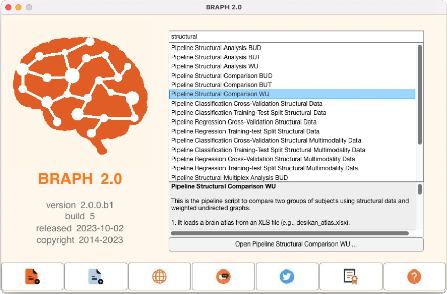
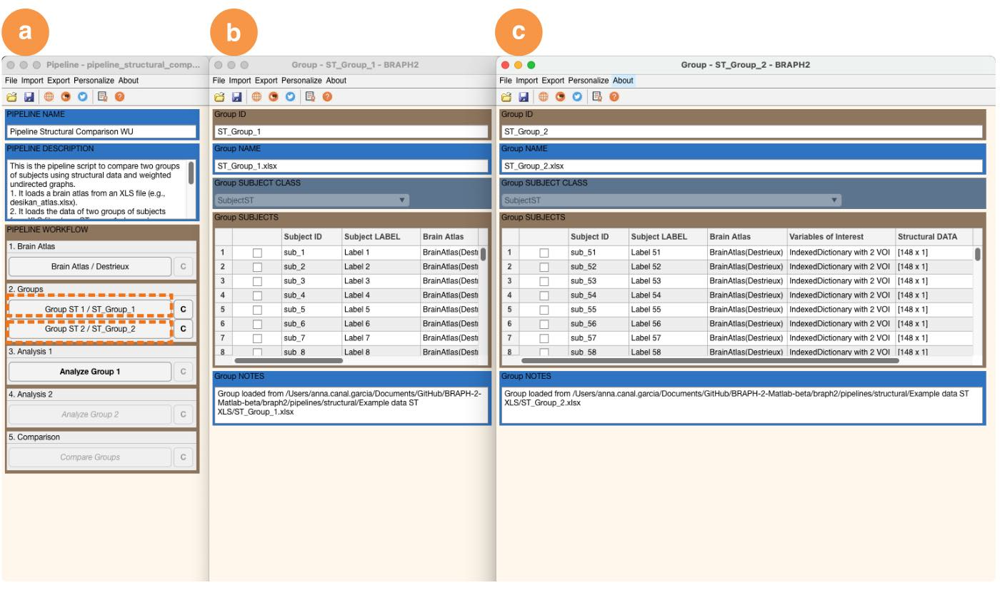
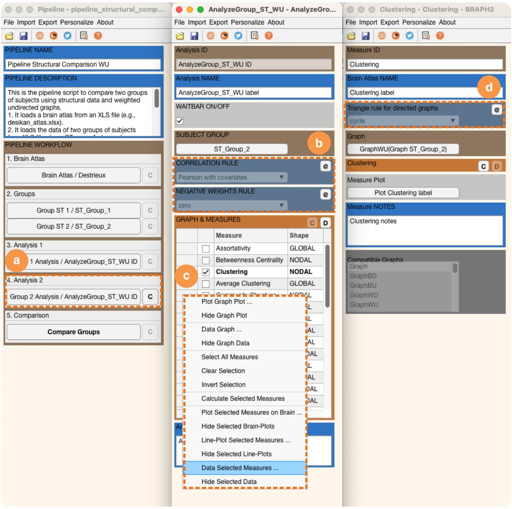

# Pipeline for Comparison of Weighted Structural Data using Weighted Graphs

[](tut_a_st_wu.pdf)


> **Figure 1. Figure examples**
> Examples of displays of `Clustering` with weighted structural data obtained using BRAPH 2.


 


This tutorial shows how to perform a network analysis using _structural data_ (see tutorialhref{https://github.com/braph-software/BRAPH-2/tree/develop/tutorials/general/tut_gr_st}{Group of Subjects with Structural Data}), where one connectivity matrix per group is calculated, as in T1-weighted imaging, static arterial spin labelling and positron emission tomography Step by step, this pipeline guides you to compare the data from two groups of subjects using their unthresholded weighted matrices, which correspond, for example, to correlation coefficients in cortical thickness, blood perfusion or glucose metabolism. You will also be able to generate publication-quality figures.

## Table of contents
>
> [Generate Example Data](#Generate-Example-Data)
>
> [Open the GUI](#Open-the-GUI)
>
> [Step 1: Load the Brain Atlas](#Step-1:-Load-the-Brain-Atlas)
>
> [Step 2: Load the Structural Group Data](#Step-2:-Load-the-Structural-Group-Data)
>
> [Step 3: Analyzing the Data of Group 1](#Step-3:-Analyzing-the-Data-of-Group-1)
>
>> [Setting Analysis Parameters](#Setting-Analysis-Parameters)
>
>> [Calculate Measures](#Calculate-Measures)
>
> [Step 4: Analyzing the Data of Group 2](#Step-4:-Analyzing-the-Data-of-Group-2)
>
> [Step 5: Comparing Groups](#Step-5:-Comparing-Groups)


## Generate Example Data
[Go back to Table of contents](#table-of-contents)

You can generate the example data by typing in the command line the instruction in Command to generate example data.

**Command to generate example data.**
		Command to generate the example data for structural analyses. They will be placed in the folder "./braph2/pipelines/structural/Example data ST XLS", and include the brain atlas "atlas.xlsx", two folders with the subject files "ST_Group_1_XLS" and "ST_Group_2_XLS", and the associated covariates files "ST_Group_1_XLS.vois" and "ST_Group_2_XLS.vois". The details about the format of these files can be found in the tutorialshref{https://github.com/braph-software/BRAPH-2/tree/develop/tutorials/general/tut_ba
> ```matlab
> 
> 	create_data_ST_XLS()
> 


## Open the GUI
[Go back to Table of contents](#table-of-contents)

The general GUI of BRAPH 2.0 can be opened by typing `braph2` in MatLab's terminal. This GUI allows you to select a pipeline, in this case, _Pipeline Structural Comparison WU_, as shown in Figure 3.




> **Figure 2. BRAPH 2 main GUI**
> BRAPH 2 main GUI with the pipeline _Pipeline Structural Comparison WU_ selected.



> **Pipeline launch from command line**
 To open the GUI and upload the structural comparison pipeline, you can also do it from the command line by typing the commands in Code to launch the GUI to upload a pipeline file to compare two groups of subjects. 
> ```matlab
> im = ImporterPipelineBRAPH2( ...
> 	'FILE', which('pipeline_structural_comparison_wu.braph2') ...
> 	);
> 	pip = im.get('PIP');
> 	
> 	gui = GUIElement('PE', pip, 'WAITBAR', true); gui.get('DRAW')
> 	gui.get('SHOW')
> ```


Once the pipeline is uploaded, you can see a GUI that contains different steps: to upload a brain atlas, to upload the structural data of two groups, analyze them, and finally, to compare the groups (Figure 3). 

 This figure should be changed -> substitute by nice brain figures


> **Figure 3. Pipeline steps**
> These are the steps of the pipeline. Only the first step is active when the pipeline is first opened. Subsequent steps will become active sequentially.


## Step 1: Load the Brain Atlas
[Go back to Table of contents](#table-of-contents)
Figure 4 shows how to upload and plot the brain atlas that you used to extract the _structural data_ for your analysis. For more information on where to find different atlases or how to change plotting settings on the brain surface, check thehref{https://github.com/braph-software/BRAPH-2/tree/develop/tutorials/general/tut_ba}{Brain Atlas} tutorial.

 This figure should be changed -> remove b


> **Figure 4. Uploading the Brain Atlas**
> Steps to upload the brain atlas:
	**a** Click on "Load Atlas" from the pipeline GUI.
	**b** Navigate to the "./braph2/pipelines/structural/Example data ST XLS" and select the atlas file "atlas.xlsx" that would be used in this example. You can also plot the brain atlas by pressing "Plot Brain Atlas". 


 
## Step 2: Load the Structural Group Data
[Go back to Table of contents](#table-of-contents)

After you loaded the brain atlas, you can upload the _structural data_ for each group as in Figure 5. A new interface will be shown containing the data for the group you just selected. You can open each subject’s structural values by selecting the subject, right click, and select “Open selection” (for more information check the tutorialhref{https://github.com/braph-software/BRAPH-2/tree/develop/tutorials/general/tut_gr_st}{Group of Subjects with Structural Data}).	

 This figure should be changed -> c should have Open Selection



> **Figure 5. Loading the Group Data**
>  change this legend
	**a** From the pipeline GUI, click on "Load Group ST 1 XLS" to load the data of group 1, and "Load Group ST 2 XLS" to load the data of group 2.
	**b** Data for group 1 is uploaded. **c** Data for group 2 is uploaded.


## Step 3: Analyzing the Data of Group 1
[Go back to Table of contents](#table-of-contents)
 
After you have loaded the data for both groups, you can analyze the data of your first group by clicking on "Analyze Group 1" (Figure 6a-b). A new interface will be shown that allows you to pre-calculate network measures for this group and explore them. First of all, you can specify the parameters for constructing the graph from the structural group data (Figure 6c): you can select the statistical test to calculate correlations in structural values between pairs of brain regions (Figure 6d), and you can decide how you want to analyze the negative weights from the correlations (Figure 6e). 

Before these network measures are calculated, it is important to ensure the following things: 
1. The analysis parameters are set correctly.
2.The graph parameters are set correctly.
3.The measures are configured with the parameters you desire (note that not all measures have parameter


Importantly, the parameters you select at the beginning will remain fixed for the rest of pipeline (including the analysis of the second group and the comparison between groups). We will now guide you through the process of preparing these parameters for both measures and graphs. It is important to keep in mind that the default parameters should work well for most cases.

### Setting Analysis Parameters
[Go back to Table of contents](#table-of-contents)


First of all, you can specify the parameters for constructing the graph from the structural group data (Figure 6c).In the `CORRELATION RULE` section, you can select the statistical test to calculate correlations in structural values between pairs of brain regions (Figure 6d).
In the `NEGATIVE WEIGHTS RULE` you can decide how you want to analyze the negative weights from the correlation (Figure 6e). 


> **Figure 6. Analyze the Group Data**
> **a** Click on "Analyze Group 1" in the pipeline's GUI.
    **b** After clicking on "Analyze Group 1" in the pipeline's GUI, a new window will appear where first you can select the parameters for the graph construction **c**. In this pipeline, you can select the statistical test to be used for the correlations **d**, and what you want to do with the negative correlation weights **e**.


> **Figure 7. Setting Analysis Parameters**
> **a** Click on "Data Selected Measures" after selecting the measure.
	**b** This new window shows the array of values for the measure, in this case "Clustering".
 	**c** This new window shows the array of values for the measure, in this case "Clustering".
 	**d** After the calculation of the measure, a new table appears with the measure results, and the rule is blocked (in blue).


 
### Calculate Measures
[Go back to Table of contents](#table-of-contents)
After the rule is set, you can calculate the measure by pressing the "C" (Figure 7c) and the results will appear in a new table within the same panel (Figure 7d). Also notice that after the measure is calculated, the rule is blocked (Figure 7d).
 
If you want to visualize the results, select the measure and press "Plot Selected Measures on Brain" in the analysis' GUI (Figure 8a). In settings (Figure 8b-c), you can change the visualization of the plots and save them. 
 


> **Figure 8. Visualize the measure's results in a brain plot**
> **a** Click on "Plot Selected Measures on Brain" in the analysis' GUI and a brain surface with the results from the calculated measures will appear. The size of the spheres and the color are proportional to the measure's value.   
    **b** In the new window, press the button settings to obtain further visualization options of the results **c**. 


 
 Finally, when you do right click, in the "GRAPH & MEASURES" panel, there are other options you can explore such as "Plot Graph Plot" (connectivity adjacency matrix) as well as Data Graph (labels of brain regions, values of the adjacency matrix, options to plot matrix and histogram), all of which can also be saved.
  
## Step 4: Analyzing the Data of Group 2
[Go back to Table of contents](#table-of-contents)

After the analysis of group 1, you can proceed with the analysis of the second group by clicking on "Analyze Group 2" (Figure 9a). You will notice that, in the new window that is shown (Figure 9b-d), the parameters you selected for group 1 are already selected and fixed for this analysis (both graph and measure parameters). If you realize that some of the options you previously selected are not the ones you would like, you can reset the analysis parameters of group 1 by clicking on the C checkbox next to it.




> **Figure 9. Parameters blocked in Analysis of Group 2**
> **a** Click on "Analysis 2" in the pipeline's GUI.
	**b** In this new window, you can see that the graph properties such as "Correlation rule" and "Negative weights rule" are blocked since they are the same as the ones set in the analysis of group 1. If you select a measure, in this case "Clustering", and press "Data Selected Measures" **c**, you can observe that the measure's rules and parameters are also set in case you calculated the measures in analysis 1, and if not, you can set the rule by pressing at the "@" **d**.


 
## Step 5: Comparing Groups
[Go back to Table of contents](#table-of-contents)

Once you have explored the network measures for each group, you can proceed with their statistical comparison. To do this, you should click on "Compare Groups" (Figure 10a) and in the new window select if you want a waiting bar and verbose functions ON while you wait for the analysis to finish, as well as how many permutations you want to use to assess differences between groups ({Figure 10b}). If the groups are not independent but represent the same subjects in two different points in time, you can select the longitudinal comparison option, which will permute the values within each subject ({Figure 10b}). We set the permutations to 10 for computational time purposes ({Figure 10c}), but for your research analysis we recommend using 1000 or 10000 permutations to guarantee the results are robust. Finally, you can select the graph measures you want to compare between groups and once you have selected all the measures you are interested in, you should right click and select "Calculate all selected comparisons" ({Figure 10d}). If you turn ON the wait bar and verbose functions, two window bars will open that show you at which point in time the comparison calculation is. There is one last option on this GUI that you can select to save intermediate results during the permutations.


> **Figure 10. Compare the Group Data**
> **a** Click on "Compare Groups" in the pipeline's GUI.
	**b** In this new window, you can select what to turn ON/OFF the wait bar and verbose functions, you can change the number of permutations, and whether to perform a longitudinal group comparison. We set the number of permutations to 10 for this tutorial **c**. Finally, you can calculate the comparison of some graph measures between groups **d**.


 
To obtain the results from the measure/s comparison, select the measures in the "GRAPH & MEASURES" panel and press "Data Selected Comparisons"({Figure 11a}), and a new window will open ({Figure 11b}) where we can check the difference value between groups, the p-values (1-tailed and 2-tailed), as well as the confidence intervals.


> **Figure 11. Visualize the comparison results in a table**
> **a** Click on "Data Selected Comparisons" in the Comparisons panel.
	**b** In this new window, you can see the results from the comparison: the difference values between groups, the p-values (1-tailed and 2-tailed), as well as the confidence intervals.


Finally, we can visualize the comparison results on a brain surface by selecting the measure comparisons we want and right click and press "Plot Selected Comparisons on Brain" ({Figure 12a}). A new window with comparison results on a brain surface will appear, where blue color indicates group 1 > group 2 and red color group 2 > group 1, and the size of the spheres is proportional to the absolute difference value between groups. If you press the Settings button ({Figure 12b}), then you will have available more options, for example to apply FDR correction to your plot ({Figure 12c}), which by default is set to off.


> **Figure 12. Visualize the comparison results on a brain surface**
> **a** Click on "Plot Selected Comparisons on Brain" in the comparison's GUI and a brain surface with the results from the calculated measures comparison will appear. The size of the spheres is proportional to the measure value difference between groups and the colors indicate if it is a positive or negative difference.   
    **b** In the new window, press the button settings to obtain further visualization options of the results. 
    **c** In the settings, you can activate the FDR correction by setting the desired q value and changing from off to on the button.
