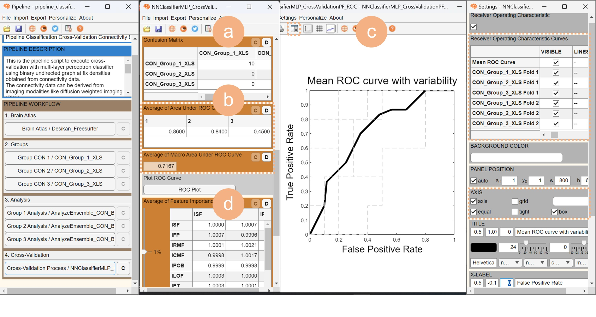

# Pipeline for Neural Network Classification of Connectivity Data using Binary Undirected Graphs at Fixed Densities

[](tut_nn_clas_con_bud_g.pdf)

This tutorial shows how to perform a neural network analysis using *connectivity data* (see tutorial [Group of Subjects with Connectivity Data for NN Classification](https://github.com/braph-software/BRAPH-2/tree/develop/tutorials/general/tut_gr_con_nn/tut_gr_con_nn.pdf)), where one connectivity matrix per subject is available, as in diffusion weighted imaging or pre-calculated matrices obtained from functional MRI, MEG, or EEG. Step by step, this pipeline leads you to classify the data from two groups of subjects at fixed thresholds, which correspond, for example, to fixed levels of white matter integrity or of correlation between activation signals of pairs of brain areas.  With this tutorial, you will be able to differentiate subjects with neural network classification techniques. You will also be able to generate publication-quality figures.


%\fig{marginfigure}
	%{fig:01}
	{
	%\includegraphics{fig01_01.jpg}
	%\includegraphics{fig01_02.jpg}
	%\includegraphics{fig01_03.jpg}
	%}
	%{Figure examples}
	%{
	%Examples of displays of "Community Structure" with connectivity data binarized at fixed thresholds obtained using BRAPH 2.
	%}
	
## Table of Contents
> [Generate Example Data](#Generate-Example-Data)
>
> [Open the GUI](#Open-the-GUI)
>
> [Step 1: Load the Brain Atlas](#Step-1-Load-the-Brain-Atlas)
>
> [Step 2: Load the Connectivity Group Data](#Step-2-Load-the-Connectivity-Group-Data)
>
> [Step 3: Analyzing the Data of Group 1](#Step-3-Analyzing-the-Data-of-Group-1)
>
>> [Setting Analysis Parameters](#Setting-Analysis-Parameters)
>>
>> [Setting Graph Parameters](#Setting-Graph-Parameters)
>>
>> [Calculate Graphs](#Calculate-Graphs)
>>
> [Step 4: Analyzing the Data of Group 2 and Group 3](#Step-4-Analyzing-the-Data-of-Group-2-and-Group-3)
>
> [Step 5: Cross-Validation](#Step-5-CrossValidation)
>
>> [Setting Training Parameters](#Setting-Training-Parameters)
>>
>> [Train Neural Networks](#Train-Neural-Networks)
>>


<a id="Generate-Example-Data"></a>
## Generate Example Data  [⬆](#Table-of-Contents)

You can generate the example data by typing in the command line the instruction in Code 1.
%

> **Code 1.** **Command to generate example data.**
> 		Command to generate the example data for connectivity analyses. They will be placed in the folder "./braph2/pipelines/connectivity NN/Example data NN CLA CON XLS", and include the brain atlas "atlas.xlsx", three folders with the subject files "CON_Group_1_XLS", "CON_Group_2_XLS", and "CON_Group_3_XLS", as well as the associated covariates files "CON_Group_1_XLS.vois", "CON_Group_2_XLS.vois", and "CON_Group_3_XLS.vois". The details about the format of these files can be found in the tutorials [Brain Atlas](https://github.com/braph-software/BRAPH-2/tree/develop/tutorials/general/tut_ba) and [Group of Subjects with Connectivity Data for NN Classification](https://github.com/braph-software/BRAPH-2/tree/develop/tutorials/general/tut_gr_con_nn/tut_gr_con_nn.pdf).
> ````matlab
> test_NNDataPoint_CON_CLA
> ````
> 

<a id="Open-the-GUI"></a>
## Open the GUI  [⬆](#Table-of-Contents)

The general GUI of BRAPH 2.0 can be opened by typing `braph2` in MatLab's terminal. This GUI allows you to select a pipeline, in this case, *Pipeline Classification Cross-Validation Connectivity BUD*, as shown in Figure 1.


> **Figure 1. BRAPH 2 main GUI**
> BRAPH 2 main GUI with the pipeline *Pipeline Classification Cross-Validation Connectivity BUD* selected.


> **Pipeline launch from command line**
> To open the GUI and upload the connectivity comparison pipeline, you can also do it from the command line by typing the commands in Code 2.
> %
> 
> > **Code 2.** **Code to launch the GUI to upload a pipeline file to classify two groups of subjects.**
> > 		This code can be used in the MatLab command line to launch the GUI to upload a pipeline file.
> > ````matlab
> > im = ImporterPipelineBRAPH2( ...
> >     'FILE', which('pipeline_classification_cross_validation_connectivity_bud.braph2') ...
> >     );
> > pip = im.get('PIP');
> > 
> > gui = GUIElement('PE', pip, 'WAITBAR', true); gui.get('DRAW')
> > gui.get('SHOW')
> > ````
> >

Once the pipeline is uploaded, you can see a GUI that contains different steps to: upload a brain atlas, upload the connectivity data of three groups, analyze them, and finally, classify them with cross-validation (Figure 2). 


<a id="Step-1-Load-the-Brain-Atlas"></a>
## Step 1: Load the Brain Atlas  [⬆](#Table-of-Contents)

Figure 3 shows how to upload and plot the brain atlas that you used to extract the *connectivity data* for your analysis. For more information on where to find different atlases or how to change plotting settings on the brain surface, check the tutorial [Brain Atlas](https://github.com/braph-software/BRAPH-2/tree/develop/tutorials/general/tut_ba).


> **Figure 2. Pipeline steps**
> These are the steps of the pipeline. Only the first step is active when the pipeline is first opened. Subsequent steps will become active sequentially.


 

<a id="Step-2-Load-the-Connectivity-Group-Data"></a>
## Step 2: Load the Connectivity Group Data  [⬆](#Table-of-Contents)

After you loaded the brain atlas, you can upload the *connectivity data* for each group as shown in Figure 4. A new interface will be shown containing the data for the group you just selected. You can open each subject’s connectivity matrices by selecting the subject, right click, and select “Open selection” (for more information check the tutorial [Group of Subjects with Connectivity Data for NN Classification](https://github.com/braph-software/BRAPH-2/tree/develop/tutorials/general/tut_gr_con_nn/tut_gr_con_nn.pdf)).


> **Figure 3. Uploading the Brain Atlas**
> Steps to upload the brain atlas:
> 	**a** Click on "Load Atlas" from the pipeline GUI.
> 	**b** Navigate to the BRAPH 2.0 folder "atlases" and select one of the atlas files, in this example the "atlas.xlsx". 
> 	**c** You can visualize the brain atlas by pressing "Plot Brain Atlas".


<a id="Step-3-Analyzing-the-Data-of-Group-1"></a>
## Step 3: Analyzing the Data of Group 1  [⬆](#Table-of-Contents)

Once you have loaded the data for three groups, you can begin analyzing the data for the first group by clicking on "Analyze Group 1" (Figure 4a). 
This action will open a new interface called "Analyze Ensemble", which allows you to calculate and visualize graph adjacency matrices for the first group. 
Before these adjacency matrices are calculated, it is important to ensure the following: 

	- The analysis parameters are set correctly (e.g., the densities).
	- The graph parameters are set correctly.


Importantly, the parameters you select at the beginning will remain fixed for the rest of pipeline (including the analysis of the second and third group and the neural network classification). We will now guide you through the process of preparing these parameters for graphs. It is important to keep in mind that the default parameters are typically suitable for most cases.

<a id="Setting-Analysis-Parameters"></a>
### Setting Analysis Parameters  [⬆](#Table-of-Contents)

In the "Analyze Ensemble" interface (Figure 5), you can configure the analysis parameters.
In the `DENSITIES` section, you can define the densities by entering values like `1:1:2` (you can also use any other valid mathematical expression, such as `1 2`, or `1:1:2`).


> **Figure 4. Loading and visualizing the group data**
> **a** From the pipeline GUI, click on "Load Group CON 1 from XLS" to load the data of group 1.
> 	**b** Once the data is uploaded, you can select a subject, right click and select `Open selection`.
> 	**c** This will open the connectivity matrix of the subject in addition to the age and sex of that subject (which are the variables of interest available for the example data).
> 	You can then repeat the same procedure for group 2 and group 3.


<a id="Setting-Graph-Parameters"></a>
### Setting Graph Parameters  [⬆](#Table-of-Contents)

To configure the graph parameters, you click on the section `GRAPH & MEASURE PARAMETERS` (Figure 6). This will open a new interface for graph template settings. 
In brain connectivity analysis, densities values dictate the required connection density between different brain regions for them to be considered “connected” in a binary undirected graph. 
Adjusting these densities allows you to explore varying levels of brain connectivity, providing insights into how regions communicate at different density settings.


> **Figure 5. Configuring analysis parameters**
> **a** To initiate the analysis of data for group 1, click on "Analyze Group 1".
> 	**b** You define the densities in the `DENSITIES` section.


The available parameters are:

	- `SYMMETRIZATION RULE` determines how to symmetrize the matrix.
	- `NEGATIVE EDGE RULE` determines how to remove the negative edges.
	- `NORMALIZATION RULE` determines how to normalize the weights between 0 and 1.
	- `DENSITIES` determines the densities. *This cannot be set here. It is set in the previous step.*
	- `RANDOMIZE ON/OFF` determines whether to randomize the graph. *Typically not used.*
	- `RANDOM SEED` is the randomization seed. *Typically not used.*
	- `RANDOMIZATION ATTEMPTS PER EDGE` is the attempts to rewire each edge. *Typically not used.*


Since this pipeline uses the graph adjacency matrices as the input to train the neural network classifiers, setting and calculating measures are not necessary.

<a id="Calculate-Graphs"></a>
### Calculate Graphs  [⬆](#Table-of-Contents)
 
After configuring the parameters, you can proceed to calculate specific graph adjacency matricees (Figure 7). To do this, return to the "Analyze Ensemble" interface (Figure 7a) and scroll down to locate the "Individual GRAPHS" panel. By clicking the 'C' button, you will see a table displaying all subjects.


> **Figure 6. Configuring Graph Parameters**
> **a** By clicking on the section `GRAPH & MEASURE PARAMETERS`, you open **b** a new interface that permits you to configure the graph parameters.
> 	**c** The available parameters shall be set at this point.


As an example, let us select the first subject, for which we previously set the graph parameters to construct the subject's graph accordingly. 
Right-click on the top of the table and select `Plot Selected Adjacency Matrices` within the Analyze Ensemble interface (Figure 7b). This will open a figure panel with the "Adjacency Matrix" plotted on it.

Within the toolbar of the adjacency matrix plot, you can explore various views.
For instance, by clicking on the `Show axis` button (Figure 7d), you will get the same axis as shown in Figure 7. Additionally, clicking on the `Settings Panel Figure` button (Figure 7c) in the same toolbar allows you to adjust different visualization settings.

For instance, within the settings menu (Figure 7e), you can turn on `tight`, resulting in the same kind of figure as shown in Figure 7. Within the settings menu, you can customize the visualization of the plots and save them for reference.

Finally, when you right-click in the `Individual GRAPHS` panel, you will find other options to explore, such as `Plot Selected Histograms` (which generates histogram plots for the adjacnecy matrices at different densities and/or different nodes) and `Data Selected Graph ...` (providing the calculated values of individual graphs). These options can also be saved for further analyses outside BRAPH 2.0.

<a id="Step-4-Analyzing-the-Data-of-Group-2-and-Group-3"></a>
## Step 4: Analyzing the Data of Group 2 and Group 3  [⬆](#Table-of-Contents)

After completing the analysis of the first group, you can analyze the second and third group by simply clicking on `Analyze Group 2` and `Analyze Group 3` (Figure 8a). You will notice that in the new GUI (Figure 8b-c), the parameters you previously selected for the first group are already preselected and fixed for this analysis. 


> **Figure 7. Analyzing the Group Data**
> **a** Locate the `Individual GRAPHS` panel and click the `C` button to see all available individual subjects. Choose the subjects you would like to see their graph data.
> 	**b** To visualize the results, right-click on the top of the table and choose `Plot Selected Adjacency Matrices` in the Analyze Ensemble interface. This action opens a figure panel with the `Adjacency Matrix` plotted for those selected subjects.
> 	**c** Adjust visualization settings by clicking on the `Settings Panel Figure` button in the figure toolbar.
> 	**d** Adjust visualization settings by clicking on the `Show axis` button in the same toolbar.
> 	**e** Customize and save plot visualizations within the settings menu. Here, we turned on the option to show the axis to be tight.


	
If you want to change some of the parameters you previously selected, you can reset the analysis parameters by clicking on the cancel button marked with a `C` (Figure 8d) near the analysis of the first group.
 

<a id="Step-5-CrossValidation"></a>
## Step 5: Cross-Validation  [⬆](#Table-of-Contents)

Once you have analyzed the data for three groups, you can begin training the neural networks by clicking on "Cross-Validation" (\Figref{fig:10}a). 
This action will open a new interface called "Cross Validation", which allows you to train the neural networks in a cross-validation manner.
Before these neural networks are trained, it is important to ensure the following: 

	- The neural networks parameters are set correctly (e.g., epochs, shuffle rule).
	- The evaluator parameters are set correctly (e.g, permutation times).


> **Figure 8. Parameters blocked in the Analysis of Group 2 and Group 3**
> **a** Click on "Analysis 2" in the pipeline's GUI.
> 	**b** In this new window, you can see that the measure parameters, such as the **b** "GRAPH TEMPLATE" and graph property **c** "DENSITIES", are blocked since they should be the same as the ones set in the analysis of group 1. You can reset the analysis parameters for Group 1 by clicking on the checkbox marked with a 'C' next to the settings of Group 1 **d**.

\fig{figure}
	{fig:10}
	{
	\includegraphics{fig10a.jpg}
	\includegraphics{fig10b.jpg}
	}
	{Setting Training Parameters}
	{
	**a** Click on `Cross-Validation` in the pipeline's GUI.
	**b** In this new window, you can select to turn ON/OFF the verbose functions, you can determine whether to show the training progress, and you can change the number of folds.
 	We set the number of k folds to 2 for this tutoria
	**c** By clicking on the section `Template for Neural Network Classifier`, you open **d** a new interface that permits you to configure the neural network classifier parameters.
	**d** The available parameters shall be set at this point.
	**e** By clicking on the section `Template for Neural Network Evaluator`, you open **f** a new interface that permits you to configure the neural network evaluator parameters.
	}

Importantly, the parameters you select at the beginning will remain fixed for all folds. We will now guide you through the process of preparing these parameters for neural networks and evaluators. It is important to keep in mind that the default parameters are typically suitable for most cases.

<a id="Setting-Training-Parameters"></a>
### Setting Training Parameters  [⬆](#Table-of-Contents)

In the "Cross-Validation" interface (\Figref{fig:10}b), you can configure the analysis parameters.

In the new window, you have several options to configure the cross-validation analysis. First, you can choose whether to enable the verbose functions and training-progress plots (\Figref{fig:10}b) while the analysis is running, which can help you monitor the progress of the analysis. 
In the `K FOLDS` section, you can define the densities by entering values of folds.

To configure the training parameters, you click on the section `Template for Neural Network Classifier` (\Figref{fig:10}c). This will open a new interface for neural networks template settings (\Figref{fig:10}d). 

The available parameters are:

	- `TRAINING EPOCHS` determines the number of epochs.
	- `TRAINING BATCH` determines the size of the mini-batch used for each training iteration.
	- `TRAINING SHUFFLE` determines the option for data shuffling.
	- `TRAINING SOLVER` determines the solver for training neural network.


To configure the evaluator parameters, you click on the section `Template for Neural Network Evaluator` (\Figref{fig:10}e). This will open a new interface for neural networks evaluator template settings. 
The available parameter is the permutation times for permuting feature importance (\Figref{fig:10}f).


> **Figure 9. Train Neural Networks**
> **a** Locate the `Dataset List`, `Neural Network Classifier List`, and `Neural Network Evaluator List` panel and click those panels' `C` button to see all divided datasets, classifiers, and evaluators at all folds.
> 	**b** Locate the `Train All Neural Network Classifiers` panel and click the `C` button to train.


<a id="Train-Neural-Networks"></a>
### Train Neural Networks  [⬆](#Table-of-Contents)

After setting all the parameters, now it is time to traing the neural networks at all folds. 
We start the training processing by calculating the corresponding dataset, the neural network classifier, and the neural network evaluator at each fold.
Locate the `Dataset List`, `Neural Network Classifier List`, and `Neural Network Evaluator List` panel and click those panels' `C` button to see all divided datasets, classifiers, and evaluators at all folds (Figure 9a).
Next, to train the classifiers at all folds (Figure 9b), locate the `Train All Neural Network Classifiers` panel and click the `C` button to train. 

After the training process is done, locate the `Confusion Matrix` panel and click the `C` button (Figure 10a) to see how well the models are performing in terms of making correct and incorrect classification.
It is also possible to check the model performance with the Receiver Operating Characteristic (ROC) curve.
In multiclass classification, the concept of ROC curve can be extended to evaluate the model's ability to discriminate between multiple classes by treating each class as the positive class and the rest as the negative class, resulting in a set of ROC curves, one for each class.
To see the results of area under ROC curves for each class, locate the `Average of Area Under ROC Curve` and `Average of Macro Area Under ROC Curve` panel and click the `C` button (Figure 10b).
To plot the ROC curves, click the `ROC Plot` button. This action will open a panel figure plotting all ROC curves from all folds (Figure 10c).
Note that, by clicking on the Settings Panel Figure button in the toolbar of the ROC figure, you can adjust different visualization settings.



> **Figure 10. Cross-Validation Analysis**
> **c** To see the results of classification, locate the `Confusion Matrix` panel and click the `C` button. 
> 	**d** To see the results of area under ROC curves, locate the `Average of Area Under ROC Curve` and `Average of Macro Area Under ROC Curve` panel and click the `C` button.
> 	**e** To plot the ROC curves, click the `ROC Plot` button. This action will open a panel figure plotting all ROC curves from all folds.
> 	**f** To see the feature importance, locate the `Average of Feature Importance` panel and click the `C` button.


Finally, To see the feature importance, locate the `Average of Feature Importance` panel and click the `C` button (Figure 10d).
Permutation feature importance involves randomly shuffling individual input features to measure their impact on the model's predictive performance, helping to identify which features are the most influential in making classification decisions.
In Figure 10d, you can see the score of the feature importance. The values greater than 1 typically indicate that the feature contributes more to the model's predictive performance than an average feature, while values less than 1 suggest it has less impact.
